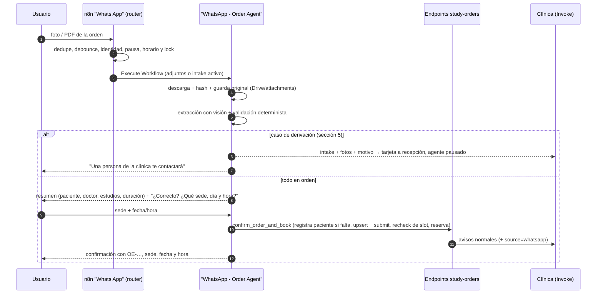
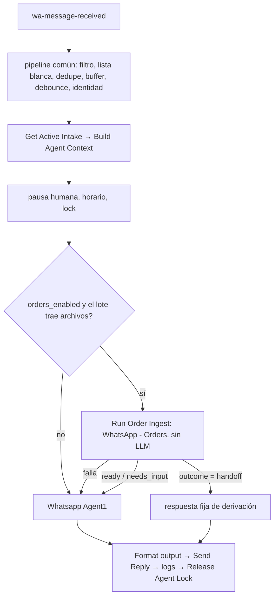

# Órdenes de estudio por WhatsApp — diseño y plan de implementación

> Estado: **Fases 0 a 5 escritas en el repo (nada ejecutado en n8n ni probado en navegador); falta medir la extracción con órdenes reales (compuerta) y la Fase 6 (QA y despliegue)** · Rama: `orden-servicio` · Fecha: 2026-09-30
> **Actualización 2026-10-05 — Separación de workflows:** el agente de órdenes ya no vive dentro de `Whats App`. Quedó en el workflow **`WhatsApp - Order Agent`** (`docs/n8n-flows/WhatsApp - Order Agent.json`), que el router del workflow normal invoca con **Execute Workflow**; los 6 webhooks `agent-tools/order-*` quedaron embebidos ahí. Ver §15.
> **Actualización 2026-10-06 — Agente único (diseño, sin implementar):** se reemplaza el router de dos agentes por **un solo agente** (`Whatsapp Agent1`) que suma la capacidad de órdenes cuando el flag está encendido. `WhatsApp - Order Agent` deja de tener LLM: queda la ingesta de archivos y los webhooks `order-*`. Ver **§17**, que reemplaza a §4.1 y a la parte de router de §15.
> **Actualización 2026-10-08 — No insistir y confianza por dato:** ante un pedido que el usuario no puede cumplir, el agente deriva en lugar de repetirlo, y cada dato extraído lleva su confianza. Ver **§20**.
> Documento de partida: artefacto "Órdenes de Estudio por WhatsApp" (Parte A funcional, Parte B diseño técnico).
> Este documento recoge las decisiones tomadas tras revisar el código real de `docs/n8n-flows/Whats App.json` y `scripts/n8n/`.

## 1. Objetivo

Que una persona escriba al WhatsApp de la clínica, mande la orden de estudio (foto o PDF) y termine con la cita agendada **sin intervención humana** cuando todo está en orden. El agente debe:

1. Registrar al paciente si no está registrado.
2. Leer la orden y extraer los estudios (y, como referencia, el nombre del doctor que figura en ella).
3. Preguntar sede, fecha y hora.
4. Crear la orden en Invoke (igual a la que crea un doctor en el portal) y agendar la cita.
5. Guardar las fotos originales para auditoría.
6. **Derivar a un humano solo en los casos definidos en la sección 5.**

La orden que llega por WhatsApp es una orden normal de Invoke. A partir de ahí se reusa todo el circuito existente (`upsert`, `submit`, bandeja, notificaciones, `recompute`, `reschedule`, `cancel`). El agente es otro canal de entrada, no un flujo paralelo.

## 2. Decisiones tomadas

| # | Tema | Decisión |
| --- | --- | --- |
| D1 | Arquitectura | **Dos workflows**: `Whats App` (general, con un **router determinista**) y **`WhatsApp - Order Agent`** (ingesta, extracción y agente de órdenes), que el router invoca con **Execute Workflow**. No hay switch de "personalidad" elegido por el usuario. |
| D2 | Doctor y técnico | **Ninguno es obligatorio.** El doctor es quien crea la orden y el técnico quien la ejecuta, pero la orden de WhatsApp se crea sin doctor derivador y su cita sin técnico (recepción lo asigna después). El nombre del doctor que figura en el papel se guarda como texto de referencia (`referring_doctor_name`), sin vincularlo a ningún usuario. No se busca ni se valida al doctor. |
| D3 | Paciente distinto del remitente (ej. un padre manda la orden de su hijo) | **Derivar a un humano.** |
| D4 | Sede | **La elige el usuario**: el agente lista las sedes con su dirección y el usuario escoge la que quiera o la que le quede más cerca. No se elige automáticamente. |
| D5 | Precio | Fuera del primer corte. |
| D6 | Revisión humana | Solo en los casos de la sección 5. El camino feliz no la requiere. |
| D7 | Vigencia de la orden y firma | No derivan. Se registran en el intake y quedan configurables. |
| D8 | Usuario de servicio | El agente crea órdenes con un usuario "Agente WhatsApp" (rol `agente_ia`) vía los endpoints existentes, no con SQL duplicado. |

Sobre D4: las sedes no guardan coordenadas (el mapa las geocodifica en el navegador), así que "la más cercana" lo resuelve el usuario leyendo las direcciones. El agente puede sugerir según la zona que el usuario mencione. Calcular cercanía con el mensaje de ubicación de WhatsApp queda como mejora futura.

## 3. Qué hay hoy (verificado en el código)

**Reutilizable tal cual:** debounce de 30 s, dedupe por `wamid`, lock por teléfono, horario del agente, pausa humana, modo test con lista blanca, `handoff_to_human`, `Agent_Availability2` (acepta `durationInMinutes` y `calendarSourceIds`), el circuito completo de órdenes y el subflujo `Attachements CRUD` (Google Drive + tabla `attachments` con `source_name`/`source_id`).

**Limitaciones que este proyecto resuelve:**

| Hoy | Consecuencia | Fase |
| --- | --- | --- |
| Solo procesa `text.body`; imagen y PDF se descartan | Hay que construir la ingesta | 2 |
| Un único prompt: servicio siempre "Consulta general", nunca pregunta sede, no agenda si ya hay una cita pendiente | Incompatible con órdenes (que pueden necesitar varias citas) | 4 |
| `Resolve Patient Identity`: `WHERE phone_number = $1 LIMIT 1` sin orden | Con teléfonos repetibles puede devolver a cualquier usuario y exponer su cuenta | **0** |
| `register_patient` solo guarda nombre, teléfono y email (sin CI); el `patient_id` nuevo no sirve en el mismo turno | Insuficiente para órdenes | 4 |
| Los 8 webhooks `agent-tools/*` no tienen autenticación y confían en el `patient_id` del body | Cualquiera que conozca la URL puede leer/crear datos | **0** |
| `study_orders.doctor_id` es `NOT NULL` y el `upsert` usa al usuario del token como doctor si no se indica otro | Una orden sin doctor quedaría a nombre del Agente WhatsApp | 1 |
| `public-book` no valida superposición de citas en el calendario | Doble reserva | **0** |
| La página pública valida slots de 30 min pero reserva la duración completa | Superposición en órdenes largas | **0** |
| Los tokens JWT de Invoke no llevan `exp` | Un JWT de servicio no caduca: se revoca quitando el rol al usuario o rotando el secreto | **0** |

## 4. Arquitectura



Las respuestas que llegan al usuario las envía siempre el workflow `Whats App` (el de órdenes solo devuelve el texto).

### 4.1 Router

Tras `Combine Buffered Messages`: si el lote trae imagen o PDF, o el teléfono tiene un intake activo, va al **agente de órdenes**. Si no, al **general**. Comparten el lock, la memoria por teléfono y la pausa humana. Si el intake se abandona o expira, el router vuelve al general. El agente de órdenes conserva `get_clinic_info` y `list_sedes` para preguntas sueltas. **Desde la separación (2026-10-05)**, el router ejecuta el workflow `WhatsApp - Order Agent` con **Execute Workflow** y este devuelve la respuesta; el envío, el tracking y el lock siguen en `Whats App`.

### 4.2 Estado del intake

Tabla `whatsapp_order_intakes` (Fase 1). Estados: `extracting`, `needs_input`, `awaiting_confirmation`, `order_created`, `booked`, `handed_off`, `abandoned`, `failed`. Guarda los adjuntos, la extracción cruda, la validación, la orden creada y la cita. `Build Agent Context` inyecta el intake activo en el prompt, así el agente retoma en el paso correcto aunque pasen horas. La memoria de 10 mensajes del LLM no sostiene este flujo.

### 4.3 Herramientas del agente de órdenes

El LLM nunca elige `patient_id`, `order_id` ni tokens. Salen del contexto y del intake.

| Herramienta | Qué hace |
| --- | --- |
| `get_order_intake` | Estado del intake activo: estudios resueltos, faltantes. |
| `answer_intake` | Completa un dato faltante o confirma/corrige una línea dudosa y revalida. |
| `list_order_sedes` | Sedes activas con dirección; el usuario elige una. |
| `list_order_slots` | Horarios libres de la sede elegida, con la **duración total** de la orden. |
| `confirm_order_and_book` | Idempotente por intake: alta del paciente si falta → `upsert` + `submit` → recheck del slot → reserva. Si el slot ya no está, devuelve alternativas y el intake sigue abierto (la orden no se duplica). |
| `handoff_order` | Deriva con un código de motivo (sección 5). |
| `get_clinic_info`, `list_sedes` | Se conservan. |

### 4.4 Autenticación

- **Webhooks `agent-tools/*`:** credencial Header Auth de n8n (secreto compartido). Las herramientas HTTP del agente envían el header. Son llamadas internas de n8n a n8n.
- **Órdenes:** desde 2026-10-07 el agente **no llama** a los endpoints `jwtAuth`: ejecuta su mismo SQL directo con el usuario "Agente WhatsApp" como actor (§18.3), así que no hace falta un JWT. Ese usuario tiene el rol `agente_ia` con permisos mínimos (`STUDY_ORDERS_CREATE`, `CREATE_FOR_DOCTOR`, `SUBMIT`, `SCHEDULE`, `VIEW_ALL`, `SEARCH_PATIENT`). **No** incluye `CANCEL`, `ACKNOWLEDGE` ni `DELETE`.
- `wa-message-received` y `wa-message-sent` siguen públicos (los llama YCloud, que no puede mandar un header propio). Su protección (firma del webhook) se evalúa aparte.

## 5. Cuándo se deriva a un humano

Reglas fijas en código, no criterio del LLM:

| Código | Situación | Acción |
| --- | --- | --- |
| `service_not_found` | Algún estudio no mapea a un servicio activo del catálogo | Derivar la orden **completa**. Nunca se agenda parcial. |
| `unreadable` | No es una orden, está ilegible o faltan nombre o CI del paciente | Pedir reenvío una vez; si persiste o el usuario dice que no tiene otra, derivar (§20). |
| `low_confidence` | Línea con confianza baja que sigue dudosa tras repreguntar | Derivar. |
| `patient_mismatch` | El paciente de la orden no es el remitente (D3) | Derivar. |
| `booking_failed` | Dos fallos de reserva seguidos o error del sistema | Derivar. |
| `user_request` | El usuario pide hablar con una persona | Derivar (ya existe). |

**Qué hace la derivación:**
- Guarda el intake con las fotos y el motivo.
- Pausa el agente para ese teléfono (pausa humana existente).
- Avisa a recepción con una tarjeta que enlaza las fotos y la extracción.
- Le dice al usuario, en una frase, que una persona de la clínica lo contactará.

## 6. Guardado para auditoría

- **Originales:** se descargan al recibirlos (los links de YCloud vencen) y se suben por `Attachements CRUD` (Drive + `attachments`). Se guarda sha256, mime, tamaño, `wamid` y fecha. Se conservan también los de intakes derivados o abandonados.
- **Reproducibilidad:** en el intake quedan la extracción cruda, la validación, el modelo y la versión del prompt. Nunca se sobrescriben.
- **Vínculo:** `study_orders.source = 'whatsapp'` y `source_intake_id`.
- **Visibilidad:** el detalle de la orden muestra las fotos originales junto al resumen extraído.
- **Datos de salud:** el proveedor del modelo de visión debe cumplir las condiciones de tratamiento de datos de la clínica; se define plazo de retención y quién puede ver los originales.

## 7. Seguridad

- El contenido de la imagen es **entrada no confiable**. El LLM conversacional recibe el resultado ya validado, nunca el archivo. Los textos libres extraídos (`notes`, `aclaracion`) se pasan como datos, con longitud acotada, nunca como instrucciones.
- Un doctor solo ve las órdenes donde es derivador; eso no cambia.
- Horas siempre en `America/Montevideo` explícito, no `new Date()` con la zona del servidor.
- El token de agendamiento, si se usa, no entra al contexto del LLM.

## 8. Fases

| Fase | Contenido | Criterio de salida |
| --- | --- | --- |
| **0 · Base** | Autenticar `agent-tools`; usuario y rol `agente_ia` + JWT; resolución de teléfono sin ambigüedad; validar superposición en `public-book`; corregir la duración en la página pública. | Nada expuesto sin secreto. |
| **1 · Datos** | Migración: `whatsapp_order_intakes`, columnas de adjunto en el buffer y los mensajes, `study_orders.source` y `source_intake_id`, tipo de notificación para derivaciones. | Esquema versionado en `database/scripts/`. |
| **2 · Adjuntos** | Filtro de imagen y PDF, debounce con varios archivos, descarga, hash y almacenamiento; respuesta para audio o archivos excedidos. | Varias fotos de una orden forman un solo intake. |
| **3 · Extracción y validación** (sin chat) | Subflujo de visión con salida estructurada y validador determinista. Se prueba offline con 30–50 órdenes reales anonimizadas. | **Compuerta:** aciertos por línea y por orden medidos antes de conectar el chat. |
| **4 · Agente de órdenes** | Router, segundo agente y prompt, herramientas de 4.3. Se prueba en modo test. | Camino feliz completo contra DEV con la lista blanca. |
| **5 · Recepción** | Etiqueta "WhatsApp", filtro "Derivadas", tarjeta de derivación con visor de fotos, `change` en la tarjeta. | Recepción resuelve una derivación sin salir de Invoke. |
| **6 · QA y despliegue** | Casos nuevos en `docs/qa/whatsapp-agent-test-battery.xlsx` (desde WA-049), actualizar WA-014, piloto con lista blanca y el flag `whatsapp_orders_enabled`. | Activación por clínica. |

**Fuera del primer corte:** precio, doctor como remitente, dependientes, mensajes interactivos, relación servicio → sede/equipo, cercanía por ubicación.

## 9. A verificar antes de la Fase 4

1. **`doctorId` en `Agent_Availability2`:** el doctor de la cita es el derivador, no quien ejecuta el estudio. Si el subflujo lo usa, bloquearía horarios por consultas del doctor. Debe ir vacío.
2. **Ruta de agendado:** `public-book` (simple, sin Google Calendar) o `appointments/upsert` + `link-appointment` (lo que hace recepción, con sincronización).
3. **Unicidad de teléfono y CI** en `users` y el endpoint de alta con `identity_document_type`.
4. **YCloud:** formato del payload de imagen/documento y vigencia del link de descarga.
5. **`Agent_Availability2` está pensado para consultas con doctor, y quitar el doctor de la orden NO lo resuelve.** Su modo "listar" arma los huecos a partir de la disponibilidad de los *doctores* (`ids_disponibles`) y descarta a quien ya es `assignee_id` de una cita solapada. En una orden el `assignee_id` es el derivador, que no ejecuta el estudio: sus horarios de consulta no deberían condicionar ni bloquear un estudio. Para la Fase 4 hace falta una fuente de huecos basada en la **disponibilidad del calendario** (y, si aplica, del técnico), no del derivador. Verificado en el código: `Get_possible_schedules` descarta cualquier horario en el que ningún doctor figure disponible en su tabla de disponibilidad, aunque el calendario esté libre. Por eso, aunque la orden y la cita no lleven doctor, el modo listar sigue dependiendo de los doctores. Esto afecta igual al link público actual. Es el mayor riesgo técnico pendiente.
6. **Varias sedes con equipos distintos:** como la sede la elige el usuario, un estudio podría caer en una sede sin el equipo. Sin tabla servicio → sede no hay forma de impedirlo; se acepta en el primer corte y se documenta.

## 10. Fase 0 — cambios y puesta en marcha

### Qué se hizo

| Cambio | Archivo |
| --- | --- |
| Los 8 webhooks `agent-tools/*` exigen Header Auth y las 8 herramientas HTTP del agente envían el header | `docs/n8n-flows/Whats App.json` |
| Resolución de identidad por teléfono sin ambigüedad: ya no hace `LIMIT 1` a ciegas. Prefiere usuarios activos y, si queda más de uno, no elige ninguno (`phone_ambiguous`) | `Resolve Patient Identity`, `Build Agent Context` |
| Prompt: con `phone_ambiguous=true` el agente no registra ni toca cuentas y deriva a recepción | `Whatsapp Agent1` (system message) |
| `public-book` rechaza la reserva si se superpone con otra cita no cancelada del mismo calendario (responde 409) | `scripts/n8n/study-orders-sql.mjs`, `n8n-workflows/study-orders-public-book.json` |
| La página pública consulta disponibilidad con la duración total de los estudios (antes, 30 min) | `src/app/[locale]/orden/[token]/page.tsx` |
| Rol `agente_ia`, usuario "Agente WhatsApp" y 7 permisos mínimos | `database/scripts/122_20260930_whatsapp-agent-service-user.sql` |
| Generador del JWT del usuario de servicio | `scripts/n8n/generate-agent-jwt.mjs` |

### Pasos manuales para ponerlo en marcha (en este orden)

1. **n8n — credencial Header Auth** llamada `WhatsApp Agent Tools Header Auth`: nombre del header `X-Agent-Key`, valor un secreto aleatorio largo.
2. **Importar `Whats App.json`.** El JSON trae un id de credencial de relleno (`REPLACE_WITH_AGENT_TOOLS_HEADER_AUTH_ID`): en los 8 webhooks `agent-tools/*` y en las 8 herramientas HTTP hay que elegir la credencial del paso 1. Hasta hacerlo, esos webhooks no se activan. **No importar sin haber creado la credencial**, porque el agente dejaría de funcionar.
3. **Aplicar la migración 122** en DEV, luego en las demás bases.
4. **Importar `study-orders-public-book.json`.**
5. **Generar el JWT del agente** con `scripts/n8n/generate-agent-jwt.mjs` y guardarlo como credencial de n8n. Todavía no lo usa ningún nodo; se usará en la Fase 4.
6. Verificar: llamar a `agent-tools/check-availability` sin header (debe dar 403) y con header (200); escribir al WhatsApp desde un número con datos repetidos.

### Límites conocidos

- **`public-book` reduce la carrera, no la elimina**: la sentencia SQL lee una foto anterior a su propio `INSERT`, así que dos reservas simultáneas al mismo calendario pueden pasar. Quien reserva debe rechequear la disponibilidad justo antes (está previsto en `confirm_order_and_book`). Cerrarlo del todo exigiría un bloqueo por calendario en una transacción explícita.
- **`/study-orders/reschedule` tampoco valida superposición.** Se revisa en la Fase 1 (reagendar desde WhatsApp).
- **`wa-message-received` / `wa-message-sent` siguen sin autenticación**: los llama YCloud y no admite un header propio. Queda pendiente evaluar la verificación de firma del webhook.
- **El JWT de servicio no caduca** (ver la cabecera de la migración 122 para cómo cortarlo).
- **Coste de la ambigüedad:** un número compartido por varios usuarios (p. ej. una familia) queda derivado a recepción en vez de atendido por el agente. Es deliberado.
- **Dependientes y teléfonos repetibles:** hoy no hay teléfonos duplicados en DEV; la regla protege el caso en que se activen.

## 11. Doctor y técnico opcionales (decisión posterior a la Fase 0)

Revisado el código: casi todo el circuito ya tolera una orden sin doctor.

| Pieza | Estado |
| --- | --- |
| Lecturas (bandeja, detalle, citas, tablero) | Usan `LEFT JOIN users` sobre el doctor: devuelven `doctor_name` nulo. |
| Aviso al doctor (`NOTIFY_DOCTOR_SQL`) | Ya filtra `doctor_id IS NOT NULL`: sin doctor no se envía. |
| Autorizaciones (`doctor_id = $1 OR VIEW_ALL / SCHEDULE`) | Con `NULL` la primera rama es falsa y decide el permiso: correcto. |
| `public-book` | Copia `doctor_id` a `assignee_id`: con `NULL` la cita queda sin doctor. |
| Tipos del front (`doctor_id?`, `doctor_name?: string \| null`) | Ya admiten nulo. |
| Columna `study_orders.doctor_id` | **`NOT NULL`: hay que hacerla opcional (migración, Fase 1).** |
| `UPSERT_SQL` | **Si el body no trae doctor, usa al usuario del token.** Hay que permitir explícitamente "sin doctor" (un indicador en el body, honrado solo con `CREATE_FOR_DOCTOR`). |
| Técnico | `appointments.technician_id` ya es opcional. |

Consecuencias:

- El rol `agente_ia` **conserva** `STUDY_ORDERS_CREATE_FOR_DOCTOR`: es el permiso que autoriza a crear la orden sin doctor propio.
- Sin derivador, el doctor no recibe avisos de avance ni ve la orden en "Mis Órdenes". Recepción la ve en la bandeja de Órdenes.
- Las órdenes creadas por un doctor en el portal siguen llevando su doctor; nada cambia ahí.

## 12. Fase 1 — datos

### Qué se hizo

| Cambio | Archivo |
| --- | --- |
| `study_orders.doctor_id` opcional; columnas `source` (`portal`/`whatsapp`), `referring_doctor_name` y `source_intake_id` | `database/scripts/123_20260930_whatsapp-study-order-intake.sql` |
| Columnas de adjunto en `whatsapp_inbound_buffer` (`media_kind`, `media_id`, `media_url`, `media_mime`, `media_filename`, `media_caption`) y en `whatsapp_conversation_messages` (`media_kind`, `media_attachment_id`) | ídem |
| Tabla `whatsapp_order_intakes` (estados, originales por referencia, extracción cruda, validación, derivación, sede y horarios ofrecidos, cita) con un único intake activo por teléfono | ídem |
| Claves `whatsapp_orders_enabled` (nace en `false`), `whatsapp_orders_min_confidence` (`0.85`) y `whatsapp_orders_intake_ttl_hours` (`24`) | ídem |
| `POST /study-orders/upsert` acepta `without_doctor`, `source`, `referring_doctor_name` y `source_intake_id`. Los cuatro se ignoran sin `STUDY_ORDERS_CREATE_FOR_DOCTOR` | `scripts/n8n/study-orders-sql.mjs`, `generate-study-order-workflows.mjs`, `n8n-workflows/study-orders-upsert.json` |

### Decisiones de diseño

- **Originales fuera de la tabla.** Se guardan en Drive vía `Attachements CRUD` (`attachments.source_name = 'whatsapp_order_intake'`, `source_id` = id del intake). El intake guarda solo referencias (`attachment_id`, sha256, mime, tamaño, `wamid`).
- **Derivación sin tipo de notificación nuevo.** Se reutiliza `whatsapp_handoff_requested`, que `notifications_type_check` ya admite.
- **Sin campo `needs_review`.** La revisión humana solo existe en las derivaciones, que quedan en el intake (`status = 'handed_off'` + `handoff_reason`). Una restricción obliga a que ambos vayan juntos.
- **Quitar el doctor no es retroactivo:** las órdenes del portal siguen llevando el doctor que las creó.

### Pasos manuales

1. Aplicar `122` y luego `123` en DEV (después en las demás bases). **Aplicar `123` antes de importar `study-orders-upsert.json`**: el SQL nuevo escribe columnas que solo existen tras la migración.
2. Importar `study-orders-upsert.json`.
3. Numeración: 122 y 123 se eligieron porque son las siguientes libres en esta rama. Si la rama con 120 y 121 pendientes ya usa esos números, renumerar antes de fusionar.

### No verificado

- Las migraciones 122 y 123 no se ejecutaron (DEV es compartido y el acceso es de solo lectura); validé los nombres de tablas y columnas contra la base, pero no la ejecución.
- El `upsert` modificado tampoco se ejecutó, por depender de 123.

## 13. Fase 2 — ingesta de adjuntos

### Lo verificado de YCloud

- El evento `whatsapp.inbound_message.received` trae `image` o `document` con `id`, `link`, `mime_type`, `sha256` (base64), `caption` y, en documentos, `filename`.
- El `link` se puede abrir unos minutos sin credenciales y **hasta 30 días con el header `X-API-Key`**. No vence al instante como se temía, pero igual se baja y se guarda en cuanto se procesa el lote.
- Como YCloud informa el sha256 del original, se compara con el de la descarga para detectar archivos corruptos (`hash_mismatch`).

Fuente: [WhatsApp Inbound Message Webhook Examples (YCloud)](https://docs.ycloud.com/reference/whatsapp-inbound-message-webhook-examples).

### Qué se hizo en `docs/n8n-flows/Whats App.json`

| Paso | Nodo | Cambio |
| --- | --- | --- |
| Flag | `Get WhatsApp Agent Config` | Lee `whatsapp_orders_enabled` (por defecto `false`). |
| Entrada | `Filter & Extract Inbound Message` | Reconoce imagen (JPEG/PNG/WebP) y PDF; devuelve `is_processable` y los datos del adjunto. Audio, video, stickers y otros documentos se siguen ignorando. Con el flag apagado todo se comporta como antes. |
| Compuerta | `Is Processable Message?` (antes `Is New Text Message?`) | Usa `is_processable`. |
| Buffer | `Buffer Inbound Message`, `Dedupe Check`, `Claim Batch If Latest`, `Combine Buffered Messages` | Guardan y reclaman los adjuntos del lote. El lote devuelve `has_media` y `media` (máximo 6 archivos; el resto se cuenta en `media_overflow`). |
| Rama | `Has Media?` | Si el lote trae adjuntos va a la rama nueva; si no, sigue por el camino de siempre. |
| Intake | `Get Or Create Intake` | Un intake en curso por teléfono: si existe se reutiliza y se renueva su vigencia (varias fotos → un solo intake). |
| Descarga | `Split Media Files` → `Download Media` | Un ítem por archivo; descarga con la credencial `YCloud API KEY`. |
| Validación | `Validate Media` | Descarta por: descarga fallida, archivo vacío, más de 10 MB, tipo distinto del anunciado o hash que no coincide. Calcula sha256, tamaño y nombre. |
| Guardado | `Call 'Attachements CRUD' (Order Original)` | Sube el original a Drive y lo registra en `attachments` con `source_name = whatsapp_order_intake` y `source_id` = id del intake. |
| Registro | `Entry (stored)` / `Entry (rejected)` → `Append Media To Intake` | Agrega una referencia por archivo a `whatsapp_order_intakes.media`, **incluidos los descartados con su motivo**. |

### Lo que la Fase 2 NO hace (queda para las siguientes)

- **No responde al usuario.** La rama termina al guardar los originales; nadie lee la orden todavía (Fase 3) ni contesta (Fase 4). **El flag `whatsapp_orders_enabled` debe seguir en `false` hasta la Fase 4**, o el usuario que mande una foto no recibiría respuesta.
- **Audio, video y documentos que no sean PDF** siguen ignorados. La respuesta explicativa ("solo puedo leer imágenes y PDF") y el aviso de archivo demasiado grande se agregan en la Fase 4, porque necesitan pasar por el lock, el horario y la pausa humana.
- **Los adjuntos se guardan aunque la conversación esté pausada o fuera de horario**, porque la descarga no depende del agente. El router de la Fase 4 decidirá qué hacer con un intake de una conversación pausada.
- **`Track Inbound Activity` no se ejecuta para lotes con adjuntos**, así que `whatsapp_conversation_activity.last_message_at` no se actualiza. Se corrige al conectar el router (Fase 4).
- **Texto enviado junto con la foto:** el pie de foto queda en `media[].caption`, pero un texto suelto del mismo lote no llega todavía al agente.
- **Nueva foto con un intake ya avanzado:** si el intake está en `awaiting_confirmation` u `order_created`, la foto se suma a ese intake. La Fase 3/4 decide si eso abre uno nuevo.

### Puesta en marcha

1. Aplicar la migración 123 (agrega también `media_sha256` al buffer).
2. Importar `Whats App.json` (después de crear la credencial Header Auth de la Fase 0).
3. Comprobar que el id del workflow `Attachements CRUD` en el nodo `Call 'Attachements CRUD' (Order Original)` (`TTwyLGp8Gg9qDKdn`, el mismo que usa `Clinic History Workflows`) corresponde a la instancia de n8n.
4. Con el flag en `false`, verificar que una foto sigue recibiendo el 200 "ignored" de siempre.
5. En modo test (lista blanca), poner el flag en `true`, mandar una foto y un PDF y comprobar: una fila en `whatsapp_order_intakes`, una fila por archivo en `attachments` y las referencias en `media`. Volver el flag a `false`.

### No verificado

- Probé con datos simulados la lógica del filtro (texto, imagen, PDF, .doc y audio, con el flag encendido y apagado) y la validación (`ok`, `hash_mismatch`, `unexpected_mime`), y el JavaScript de los nodos compila. **No corrí el workflow en n8n**: ni la descarga real, ni la llamada a `Attachements CRUD`, ni las consultas nuevas.
- Supuestos a confirmar en la primera prueba: que `Attachements CRUD` devuelve `{ success, data: { id } }` para cada archivo y en el mismo orden, y que el nodo `Execute Workflow` le pasa el binario.

## 14. Fase 3 — extracción y validación

### Piezas

| Pieza | Archivo |
| --- | --- |
| Lógica pura: esquema de extracción, prompt y **validador determinista** | `scripts/n8n/study-order-intake/intake-lib.mjs` |
| 25 pruebas del validador y del esquema (`node --test scripts/n8n/study-order-intake/intake-lib.test.mjs`) | `intake-lib.test.mjs` |
| Generador del subflujo n8n | `scripts/n8n/generate-study-order-intake-workflow.mjs` |
| Subflujo generado, listo para importar | `n8n-workflows/whatsapp-study-order-intake.json` |
| Medición offline contra órdenes reales (la compuerta) | `scripts/n8n/study-order-intake/eval-extraction.mjs` |
| Clave `whatsapp_orders_vision_model` | migración 123 |

### Cómo funciona el subflujo `WhatsApp - Study Order Intake`

Entrada: `intake_id`, `mode` (`extract` o `revalidate`) y `answers` (JSON con `confirmed`, `removed`, `overrides`).

1. **Carga el contexto en una consulta:** el intake, sus originales (`attachments`), el catálogo vigente (los servicios activos de las categorías `ci-orden:cat:*`, que es lo que muestra el asistente de órdenes), las opciones del formulario y la configuración.
2. **`extract`:** baja los originales de Drive, arma un pedido al modelo con imágenes y PDF y exige **salida estructurada estricta**. Los ids de servicio son un `enum` del catálogo vigente: el modelo no puede inventar un servicio.
3. **`revalidate`:** no vuelve a llamar al modelo. Revalida la extracción guardada con lo que el usuario respondió (confirmó una línea, descartó otra, corrigió la cédula).
4. **Busca solo lo necesario:** usuarios con la cédula leída y las órdenes abiertas de ese paciente (últimos 30 días).
5. **Valida (código, no LLM)** y guarda en el intake: estado, extracción cruda, validación (con `prior`, lo ya preguntado), modelo, versión del prompt y tokens.
6. **Devuelve** `outcome` (`ready`, `needs_input` o `handoff`), `questions`, `warnings`, `patient`, `resolved` (lo que se enviaría a `upsert`) y `duplicate_of`.

### Reglas del validador

| Situación | Resultado |
| --- | --- |
| Falla del modelo | `handoff` · `system_error` |
| Teléfono asociado a más de un usuario | `handoff` · `patient_mismatch` |
| Sin archivos utilizables, no es una orden o está ilegible | Pide reenvío una vez (`needs_input`); la segunda vez, `handoff` · `unreadable` |
| Algún estudio no figura en el catálogo (o el modelo lo dejó en `unmatched_text_lines`) | `handoff` · `service_not_found` para **toda** la orden |
| Falta el nombre o la cédula, o la cédula uruguaya tiene dígito verificador inválido | Se pregunta una vez; si sigue mal, `handoff` · `unreadable` (los pasaportes no se validan) |
| El paciente de la orden no es quien escribe (otra cédula, nombre distinto, cédula de otro teléfono o duplicada) | `handoff` · `patient_mismatch` |
| Línea con confianza menor al umbral | Se pregunta por esa línea; si sigue dudosa, `handoff` · `low_confidence` |
| Falta la otra cara (dorso) u otra hoja (`missing_other_side`, §18) | Se pide una vez, antes que el resto y sin gastar el reenvío; si sigue faltando o el usuario dice que no hay, advertencia `possibly_incomplete` |
| Sin firma, fecha antigua, detalles que no encajan en el formulario | Advertencia; **no** deriva |
| Mismos estudios que una orden abierta del paciente | `duplicate_of` (la Fase 4 decide ofrecer esa orden) |
| Todo en orden | `ready`, con la orden armada y la duración total |

Lo que el formulario no puede representar (una opción desconocida, una pieza dentaria inválida) **no se pierde**: va a `clinical_notes` junto con el doctor y la fecha del papel.

El doctor se transcribe como texto (`referring_doctor_name`); no se busca ni se vincula (decisión D2).

### Cómo medirla (la compuerta)

1. Reunir 30 a 50 órdenes **reales y anonimizadas** (fotos y PDF, manuscritas e impresas) en una carpeta **fuera del repo**, cada una con su `.expected.json`.
2. Exportar el catálogo y las opciones a `catalog.json` (`{ "catalog": [...], "options": [...] }`):

```sql
-- catalog
SELECT s.id, COALESCE(s.external_id, 'id:' || s.id) AS external_id, s.name,
       c.code AS section_code, s.duration_minutes
  FROM service_catalog s JOIN miscellaneous_categories c ON c.id = s.category_id
 WHERE c.external_id LIKE 'ci-orden:cat:%' AND s.is_active ORDER BY c.code, s.id;
-- options
SELECT o.option_kind, o.code, o.label, o.section_code, o.group_code, o.input_type,
       COALESCE(sv.external_id, 'id:' || sv.id) AS service_external_id
  FROM study_order_options o LEFT JOIN service_catalog sv ON sv.id = o.service_id
 WHERE o.is_active ORDER BY o.sort_order;
```

3. Correr `OPENAI_API_KEY=... node scripts/n8n/study-order-intake/eval-extraction.mjs --catalog catalog.json --dir ./muestras`.
4. **Criterios para pasar a la Fase 4** (propuestos; los define la clínica):
   - Órdenes que debían derivarse y salieron `ready`: **0**.
   - Precisión por línea ≥ 98 % (un estudio de más es el error más caro: se agendaría algo no pedido).
   - Cédula correcta ≥ 95 %.
   - Lectura exacta por orden: la meta la fija la clínica según cuánta revisión humana tolere.
   - Comparar con otro modelo si no se alcanza.

### Lo que hay que saber

- **El modelo por defecto es el del agente (`gpt-5.6-luna`) y no verifiqué que admita imágenes ni PDF.** Es la decisión abierta 5 del artefacto original. Si no los admite, basta cambiar `whatsapp_orders_vision_model` (el subflujo no cambia).
- **Datos de salud:** las órdenes salen al proveedor del modelo. Confirmar con la clínica sus condiciones de tratamiento de datos antes de activar el flag.
- **Las instrucciones escritas dentro de una orden no se obedecen**: el prompt lo indica, el modelo solo transcribe y la salida se valida contra esquema y catálogo. Es una defensa, no una garantía; por eso la decisión final nunca la toma el LLM conversacional.
- **Probado:** el validador (25 pruebas), la generación del esquema estricto y el código de los nodos con datos simulados (incluida la segunda vuelta "cédula inválida → corrección del usuario → `ready`"). Las consultas nuevas se ejecutaron en DEV en modo lectura para comprobar la sintaxis.
- **No probado:** la ejecución real en n8n (descarga de Drive, llamada a OpenAI con imágenes y PDF, guardado en el intake, que necesita la migración 123) y, sobre todo, **la precisión de lectura sobre órdenes reales**. Hasta medirla, no hay datos para decidir si el flujo puede ir sin revisión humana.

## 15. Fase 4 — router y agente de órdenes

### Resumen

**Dos workflows** desde la separación (2026-10-05): `Whats App` conserva la entrada pública y el pipeline compartido (dedupe, debounce, identidad, pausa, horario, lock y router); el agente de órdenes y toda su ingesta viven en **`WhatsApp - Order Agent`**, que el router invoca con **Execute Workflow** y devuelve la respuesta para que `Whats App` la envíe y registre. Los horarios salen de una lógica propia (no de `Agent_Availability2`).

| Pieza | Dónde |
| --- | --- |
| Entrada, dedupe/debounce, identidad, pausa, horario, lock, router (`Route To Orders?` → `Run Orders Agent`) y respuesta a formatos no soportados | `docs/n8n-flows/Whats App.json` |
| Ingesta de adjuntos, extracción, `Order Agent`, sus 6 herramientas, continuación tras guardar los originales y respuesta fija de derivación | `docs/n8n-flows/WhatsApp - Order Agent.json` |
| Webhooks `agent-tools/order-*` (93 nodos, generado) — **ahora embebidos** en `WhatsApp - Order Agent.json`; `n8n-workflows/whatsapp-order-agent-tools.json` queda solo como referencia y **no se importa** | `scripts/n8n/generate-order-agent-tools-workflow.mjs` |
| Horarios libres (puro, con 11 pruebas) | `scripts/n8n/study-order-intake/slots-lib.mjs` |
| Clave `whatsapp_orders_calendar_ids` | migración 123 |

El snapshot de trabajo `docs/n8n-flows/WhatsApp Agent.json` (unificado + tools mergeados en un solo workflow) también queda obsoleto como fuente: las versiones vigentes son los dos archivos de la tabla.

### Flujo de un mensaje

1. **Entrada y pipeline compartido** (`Whats App`, flag encendido): imagen/PDF se consideran "procesables" y se bufferizan con sus metadatos. Pasa por la lista blanca del modo test, dedupe, debounce, identidad, pausa, horario y lock. El original **no** se descarga todavía.
2. **Formatos no soportados** (audio, video, sticker, documentos que no son PDF, imágenes que no son JPEG/PNG/WebP), con el flag encendido: respuesta fija pidiendo foto o PDF. Pasa por la lista blanca del modo test y por el dedupe.
3. **Router** (`Route To Orders?`, después del lock): va al workflow de órdenes si el lote trae un archivo o si ese teléfono tiene un intake en curso (`Get Active Intake`), y solo con `whatsapp_orders_enabled = true`. Si no, al agente general de siempre.
4. **`WhatsApp - Order Agent`** (Execute Workflow): si el lote trae archivos → se vencen los intakes inactivos (`Expire Old Intakes`) → se guardan los originales (Fase 2) → **extracción + validación** (subflujo de la Fase 3). Si el resultado es **derivación**: `order-handoff` marca el intake, avisa a recepción (reutiliza `agent-tools/handoff`: pausa la conversación y notifica con el motivo y el link del primer original) y devuelve al workflow principal el mensaje fijo (no interviene ningún LLM). Si no, sigue al agente.
5. **Agente de órdenes** (`Order Agent`): conversa y agenda con sus herramientas y devuelve el texto al workflow principal, que quita el marcador `<<PENDING:…>>`, lo formatea, lo envía y actualiza tracking, logs y lock.

### Herramientas del agente de órdenes

El modelo nunca maneja ids: todo se resuelve por el teléfono (que sale del contexto, no de lo que escriba el usuario) y por números de lista guardados en `whatsapp_order_intakes.slots_offered`.

| Herramienta | Webhook | Qué hace |
| --- | --- | --- |
| `get_order_intake` | `order-get-intake` | Estado y `next_step` (`wait`, `answer_questions`, `ask_sede_date_time`, `book_slot`), resumen y preguntas numeradas. Se llama primero en cada mensaje. |
| `answer_order_question` | `order-answer` | Traduce la respuesta (sí/no, cédula, nombre) y **revalida** sin volver a llamar al modelo de visión. Si el resultado es derivación, la ejecuta. |
| `list_order_sedes` | `order-list-sedes` | Sedes con agenda y calendarios elegibles, numeradas, con dirección. **La sede la elige el usuario** (D4). |
| `list_order_slots` | `order-list-slots` | Hasta 6 horarios para la **duración total** de la orden, según día/hora pedidos. |
| `confirm_order_and_book` | `order-confirm-and-book` | Registra al paciente si falta → crea la orden **sin doctor** (`without_doctor`, `source = whatsapp`) y la envía → revisa que el horario siga libre → genera un token de un uso y reserva con el SQL de `public-book` → marca el intake como `booked`. Todo con SQL directo, sin llamar a endpoints (§18.3). Idempotente por intake. |
| `handoff_order` | `order-handoff` | Deriva con motivo y original. |
| `get_clinic_info`, `list_sedes` | (existentes) | Preguntas sueltas. |

La orden de WhatsApp y su cita **no llevan doctor ni técnico** (D2); el nombre del papel queda en `referring_doctor_name`.

### Horarios libres (la lógica nueva)

`Agent_Availability2` no sirve para órdenes (ver sección 9): parte de la disponibilidad de los doctores. `slots-lib.mjs` calcula:

> horario de atención de la **sede** (`clinic_schedules`, se unen filas repetidas) ∩ **calendario activo** de esa sede sin citas solapadas, por la duración total, en pasos de 30 min, desde 4 h de antelación y hasta 14 días.

- Todo en hora de pared de Montevideo, como texto sin zona.
- Los calendarios elegibles se pueden acotar con `whatsapp_orders_calendar_ids` (ids separados por coma; vacío = todos los activos de la sede).
- La antelación mínima de 4 h venía de que el endpoint `public-book` comparaba la hora local contra el reloj del servidor de n8n (UTC). Desde §18.3 el agente usa solo su SQL, que compara contra la hora de Montevideo, así que ese límite ya no aplica; se mantiene en 4 h como margen operativo.

### Fallos y derivación al reservar

- Fallan y **suman un intento** (`booking_attempts`): crear o enviar la orden, el token, la reserva. Con **dos**, la herramienta ordena derivar (`booking_failed`).
- `slot_taken` (el horario se ocupó justo antes): no suma intento ni duplica la orden; el agente ofrece otros.
- Un intake con orden ya creada retoma desde la reserva.

### Puesta en marcha (en este orden)

1. Credencial en n8n (Header Auth): **`WhatsApp Agent Tools Header Auth`** (`X-Agent-Key`, Fase 0). La credencial `Invoke Agent Service JWT` ya **no** hace falta (§18.3).
2. Migraciones 122 y 123.
3. Importar, en este orden: `whatsapp-study-order-intake.json` → **`WhatsApp - Order Agent.json`** → **`Whats App.json`** (y los demás importados antes). **No importar `whatsapp-order-agent-tools.json`**: sus 6 webhooks quedaron embebidos en `WhatsApp - Order Agent`; si ya está importado, desactivarlo/eliminarlo para no duplicar los paths `agent-tools/order-*`.
4. **Reemplazar los placeholders** `REPLACE_WITH_…`: credenciales Header Auth; el id del workflow `WhatsApp - Study Order Intake` en **dos** lugares (`Answer: Run Intake Subflow` y `Run Order Extraction`); y el id de `WhatsApp - Order Agent` en el nodo `Run Orders Agent` de `Whats App`.
5. Comprobar `whatsapp_orders_vision_model` y, si hace falta, `whatsapp_orders_calendar_ids`.
6. Probar en modo test (lista blanca) con `whatsapp_orders_enabled = true`; al terminar, volver a `false`.

### Limitaciones conocidas

- **No hay ejecuciones verificadas en n8n**: la separación en dos workflows (2026-10-05) se preparó en el repo y todavía no se desplegó ni probó; el comportamiento del agente (cómo usa las herramientas, el tono, el manejo de errores) **solo se puede validar conversando con él**. El prompt es un primer borrador.
- **Un usuario con una orden en curso queda en el agente de órdenes** hasta que se agende, se derive o pasen 24 h (la vigencia del intake): durante ese tiempo no puede consultar su cuenta ni sus citas por el agente general. El agente de órdenes lo deriva a una persona en esos casos. Un router que distinga la intención es una mejora posible.
- **Horarios:** solo se consideran `clinic_schedules` y las citas del calendario. No hay feriados ni cierres de la clínica en la base que yo haya podido identificar, así que un feriado con horario cargado se ofrecería.
- **Sin relación servicio → sede/equipo:** el usuario puede elegir una sede que no tenga el equipo del estudio (p. ej. Cone Beam). Aceptado en el primer corte.
- **Carrera de reservas:** `public-book` la reduce, no la elimina (ver sección 10).
- **Una orden duplicada** se deriva a una persona; agendar una orden ya existente por WhatsApp no está construido.
- **Cancelar o reagendar** una cita de una orden por WhatsApp (Fase 1 del plan original) **no está construido**; el agente deriva.
- **Conversación pausada o fuera de horario:** desde la separación, la descarga y la extracción ya **no** corren antes de esos controles: el workflow de órdenes se invoca recién después del lock. Un archivo enviado fuera de horario o con la conversación pausada queda sin procesar hasta que llegue un mensaje en condiciones (antes se procesaba igual y podía repetirse el mensaje fijo de "te va a escribir una persona").
- **Duración del lock:** la extracción con visión ahora corre **dentro** del lock (antes corría antes de tomarlo). Si supera `whatsapp_agent_lock_timeout_seconds` (90 s por defecto), otro mensaje del mismo teléfono puede tomar el lock; conviene medirlo en las pruebas y subir el valor si hace falta.
- **Dependencia entre workflows:** con el flag encendido, las órdenes necesitan que `WhatsApp - Order Agent` esté importado y activo (ahí viven los webhooks `agent-tools/order-*`). Con el flag apagado no hay dependencia: todo va al agente general.
- Las respuestas fijas (formato no soportado, derivación) no pasan por la memoria del chat.

### Casos para la batería de pruebas (`docs/qa/whatsapp-agent-test-battery.xlsx`, desde WA-049)

Foto borrosa; orden de otra persona; estudio que no figura en el sistema (debe derivar toda la orden); varias fotos de una orden; PDF; audio y sticker; usuario no registrado (se registra con los datos de la orden); cédula con dígito verificador inválido; teléfono compartido por dos usuarios; horario tomado entre la oferta y la reserva; dos fallas de reserva seguidas; usuario que cambia de sede o de día a mitad de camino; usuario que pide hablar con una persona; orden duplicada; mensaje de otro tema con una orden en curso; instrucciones escondidas dentro de la imagen.

## 16. Fase 5 — recepción en Invoke

Objetivo: que recepción vea las órdenes de WhatsApp sin salir de Invoke, compruebe contra el original que el asistente leyó bien, resuelva las derivaciones y pueda ajustar el asistente sin tocar la base.

### Qué hay

| Pieza | Dónde |
| --- | --- |
| **Etiqueta "WhatsApp"** en la bandeja (columna del número y tarjetas) y en la cabecera del detalle | `whatsapp-source-badge.tsx`, `columns.tsx`, `study-orders-screen.tsx`, `study-order-detail-panel.tsx` |
| **Pestaña "Original"** en el detalle de una orden de WhatsApp: fotos y PDF recibidos (con vista ampliada), teléfono de origen, modelo de lectura, doctor tal como figura en el papel y advertencias de la revisión. Solo con `STUDY_ORDERS_VIEW_ALL` | `study-order-whatsapp-tab.tsx`, `whatsapp-intake-files.tsx` |
| **Vista "Derivadas de WhatsApp"** dentro de Órdenes (clínica): interruptor con contador de pendientes; una tarjeta por derivación con el motivo, paciente, teléfono, estudios leídos, estudios que no figuran en el sistema, detalle y originales; filtro Pendientes / Resueltas / Todas; **Marcar como resuelta** con nota opcional (requiere `STUDY_ORDERS_ACKNOWLEDGE`) | `whatsapp-intakes-panel.tsx` |
| **Aviso de derivación**: la tarjeta del asistente muestra el motivo de la orden y un botón a la vista anterior (`?view=whatsapp`) | `notification-card.tsx` |
| **Aviso de orden nueva**: distingue "Recibida por WhatsApp" (sin doctor derivador), "anulada" y "el paciente agendó por su cuenta" (antes los tres se veían igual) | `notification-card.tsx`, `notifications-context.tsx` |
| **Ajustes** en Sistema → Agente de WhatsApp: activar las órdenes, modelo de lectura, confianza mínima, calendarios elegibles y vigencia | `whatsapp-orders-settings-card.tsx` |

### Backend (n8n + SQL)

| Endpoint | Para qué |
| --- | --- |
| `GET /study-orders` | Ahora devuelve `source` y `referring_doctor_name`, y acepta `source=whatsapp` |
| `GET /study-orders/detail` | Ahora devuelve `source`, `referring_doctor_name`, `source_intake_id` y `whatsapp` (originales, advertencias, modelo) |
| `GET /study-orders/whatsapp-intakes` (nuevo) | Derivaciones, con estudios leídos y originales. Solo `STUDY_ORDERS_VIEW_ALL` |
| `POST /study-orders/whatsapp-intakes/resolve` (nuevo) | Marca una derivación como resuelta. Solo `STUDY_ORDERS_ACKNOWLEDGE`. No toca los originales ni la extracción |
| `GET /study-orders/whatsapp-intakes/file?intake_id=&id=` (nuevo, `study-orders-whatsapp-file.json`) | Devuelve el original desde Drive. El SQL exige archivo + intake + permiso a la vez: con el id de un adjunto de otro módulo no baja nada |
| Notificaciones de órdenes | La metadata lleva `source` y `referring_doctor_name` |

Migración 123: columnas `resolved_at`, `resolved_by` y `resolution_note` en `whatsapp_order_intakes` (con índice de pendientes).

### Decisiones

- **Los originales se piden con la sesión del usuario a n8n**, como las imágenes de la sesión clínica: el navegador nunca habla con Drive, y los `object URL` se liberan al cerrar.
- **"Resolver" solo cierra la derivación.** No crea la orden: recepción la crea con el asistente de órdenes de siempre. Precargar el formulario con lo que leyó el asistente queda para después, cuando se sepa cuán útil es.
- **El doctor de una orden de WhatsApp** se muestra como "Nombre (solo como figura en el papel, sin vincular a un usuario)", nunca como derivador.
- **Sin cambios de permisos**: se reutilizan `STUDY_ORDERS_VIEW_ALL` y `STUDY_ORDERS_ACKNOWLEDGE`.

### Puesta en marcha

1. Aplicar la migración 123 (corregida: ahora trae las columnas de resolución). **Antes** de importar los workflows de órdenes, que leen columnas nuevas.
2. Importar: `study-orders-whatsapp-intakes.json`, `study-orders-whatsapp-intake-resolve.json` y `study-orders-whatsapp-file.json` (nuevos), y los regenerados `study-orders-list`, `-detail`, `-upsert`, `-submit`, `-acknowledge`, `-cancel`, `-recompute`, `-reconcile`, `-reschedule`, `-link-appointment` y `-public-book`.
3. Desplegar el frontend.

### No verificado

- **No probé la interfaz en un navegador**: el frontend compila (`pnpm typecheck` sin errores) y los archivos tocados pasan ESLint, pero no hay backend con estas columnas ni archivos reales para ver las pantallas.
- Las consultas nuevas dependen de la migración 123 y no se ejecutaron (solo se comprobó la sintaxis de fragmentos equivalentes y la ausencia de columnas repetidas en `v_study_orders_board`).
- El motivo de la derivación en el aviso se reconoce por el texto `Orden de estudio…` que arma `order-handoff`; si ese texto cambia, la tarjeta vuelve a mostrar el comportamiento anterior.
- `pnpm lint` a nivel de todo el proyecto ya tenía 58 errores previos en otros archivos; ninguno está en los archivos de esta fase.

## 17. Rediseño: un solo agente con capacidad de órdenes (2026-10-06)

> Estado: **diseño**. Todavía no se modificaron los JSON. Reemplaza a §4.1 y al router de §15.

### 17.1 Por qué

La idea original era que el agente de WhatsApp siguiera siendo **el mismo** y que, al activar la opción, pudiera además procesar órdenes de estudio. Lo construido en §15 es otra cosa: un router determinista que manda el mensaje a **otro agente**, con otro prompt y otras herramientas. Problemas:

| Problema | Consecuencia |
| --- | --- |
| Con un intake en curso, todo va al agente de órdenes durante hasta 24 h | El usuario no puede consultar su cuenta, sus citas ni pedir una consulta: el agente de órdenes lo deriva a una persona. |
| Dos personalidades con la misma memoria (`whatsapp_agent_chat_memory`, clave = teléfono) | Cada agente lee lo que respondió el otro sin conocer sus reglas. |
| La ruta la decide el estado del intake, no la intención del mensaje | "¿Cuánto debo?" con una orden a medio cargar va al agente equivocado. |
| Con el flag encendido y algo mal desplegado (workflow sin importar, credencial, subflujo) | `Run Orders Agent` falla y el mensaje queda **sin respuesta**, ni siquiera del agente general; el lock se libera recién al vencer (90 s). |

### 17.2 Principios

1. **Un solo agente** (`Whatsapp Agent1`), un prompt base y una memoria.
2. **Las órdenes son un agregado.** Con el flag apagado, sin configurar o **sin las migraciones 122/123**, el comportamiento tiene que ser idéntico al del agente sin órdenes.
3. **Ninguna falla del lado de órdenes deja al usuario sin respuesta.** El peor caso es que el agente diga que no pudo procesar la orden y ofrezca una persona.
4. **Lo determinista sigue fuera del LLM:** descarga, guardado, extracción con visión, validación y derivación por reglas (§5).

### 17.3 Qué ya cumple el principio 2 (no se toca)

Verificado en `Whats App.json`:

- `Get WhatsApp Agent Config` calcula `whatsapp_orders_schema_ready` (existe `whatsapp_order_intakes` y la columna `media_kind` en `whatsapp_inbound_buffer` y `whatsapp_conversation_messages`). `whatsapp_orders_enabled` solo puede ser `true` si eso se cumple.
- `Dedupe Check`, `Buffer Inbound Message` y `Claim Batch If Latest` usan las consultas de antes (sin `media_*`) con el flag apagado; `Get Active Intake` no lee la tabla nueva.
- `Filter & Extract Inbound Message` solo procesa texto con el flag apagado: fotos y PDF se ignoran como antes y no hay respuesta de "formato no soportado".
- Los webhooks `agent-tools/*` del agente general no dependen de credenciales nuevas en este export.

### 17.4 Arquitectura nueva



- **No hay router de agentes.** Siempre responde `Whatsapp Agent1`; la única bifurcación es la **ingesta** (archivos con el flag encendido), que no conversa.
- La derivación por reglas de la extracción (`outcome = handoff`) mantiene su respuesta fija sin LLM, como hoy.
- Si la ingesta falla (workflow no importado, error de Drive o del modelo de visión), el mensaje sigue al agente con el contexto "no se pudo procesar el archivo", y el agente ofrece reenviarlo o hablar con una persona.

### 17.5 Cambios en `Whats App.json`

| Nodo | Cambio |
| --- | --- |
| `Route To Orders?`, `Run Orders Agent` | **Se eliminan.** |
| `Orders Ingest?` (nuevo, IF) | Después de `Lock Acquired?`: `orders_enabled && has_media`. Falso → `Whatsapp Agent1`. |
| `Run Order Ingest` (nuevo, Execute Workflow → `WhatsApp - Orders`) | Entradas: `phone`, `wamid`, `media_json`, `patient_id`, `phone_ambiguous`. `onError: continueRegularOutput` y `alwaysOutputData: true`: un error o una salida vacía siguen hacia el agente con `ingest_ok = false`. |
| `Ingest Handoff?` (nuevo, IF) | `outcome === 'handoff'` → `Ingest Handoff Reply` (Code, devuelve `{ output }` con el texto fijo + `<<PENDING:NO>>`) → `Format output`. Si no → `Whatsapp Agent1`. |
| `Build Agent Context` | Sin `route`. Mantiene `orders_enabled` e `intake_status` para el prompt. |
| `Whatsapp Agent1` | Se le conectan las 6 herramientas de órdenes (17.7) y cambia el prompt (17.6). El estado de la orden se arma con expresiones: si corrió la ingesta (`$('Run Order Ingest').isExecuted`) usa su resultado; si no, `intake_status` de `Get Active Intake`. |
| `Get WhatsApp Agent Config` | Lectura tolerante de las claves booleanas (17.9). |

### 17.6 Prompt de `Whatsapp Agent1`

La sección de órdenes se inyecta **solo** con el flag encendido, con una expresión del tipo `{{ orders_enabled ? SECCION_ORDENES : SECCION_ORDENES_APAGADAS }}`. Con el flag apagado el prompt queda como hoy.

**Flag apagado.** La regla actual "Si las órdenes de estudio están habilitadas…" se reduce a: por este medio todavía no se pueden agendar estudios con orden; ofrecele hablar con una persona (`handoff_to_human`). No usar ninguna herramienta `*_order*`.

**Flag encendido.** Sección de órdenes, adaptada del prompt actual de `Order Agent`:

- **Alcance:** agendar estudios a partir de una orden (foto o PDF). Si el usuario quiere agendar estudios y no mandó la orden, pedirle la foto o el PDF por este chat.
- **Estado de la orden en el contexto:** `sin orden`, `recién recibida: ready / needs_input`, `en curso: <status>` o `no se pudo procesar el archivo`.
- **Si hay una orden en curso y el mensaje es sobre ella:** llamar primero a `get_order_intake` y seguir `next_step` (`wait`, `answer_questions`, `ask_sede_date_time`, `book_slot`) con las reglas de §15: preguntas todas juntas, la sede la elige el usuario, horarios con `list_order_slots`, elegir un horario es la confirmación → `confirm_order_and_book`.
- **Si el mensaje es sobre otra cosa** (cuenta, citas, consulta general), se atiende normalmente con las herramientas generales. La orden queda en curso hasta que el usuario vuelva a ella o venza.
- **Separación de herramientas:** estudios de una orden → solo herramientas `*_order*`; consulta general → `check_availability` / `create_appointment`. Nunca mezclarlas.
- **Derivación:** si hay una orden en curso y el usuario pide una persona por algo de la orden, `handoff_order` (marca el intake y adjunta los originales); en cualquier otro caso, `handoff_to_human`.

**Ajustes en reglas existentes:**

- "El servicio a agendar es SIEMPRE Consulta general" y "no agendar si ya tiene una cita pendiente" pasan a aplicar **solo a turnos de consulta**. Una orden puede necesitar su propia cita aunque haya otra pendiente.
- `is_known_patient = false`: las herramientas de órdenes sí se pueden usar, porque `confirm_order_and_book` registra al paciente con los datos de la orden.
- `phone_ambiguous = true`: las herramientas de órdenes también quedan prohibidas (la ingesta ya deriva con `patient_mismatch`).
- La línea de alcance ("TU ÚNICO ROL…") suma "agendar estudios con una orden" solo con el flag encendido.

### 17.7 Herramientas de órdenes en el agente único

Se conectan a `Whatsapp Agent1` las 6 herramientas HTTP que hoy tiene `Order Agent`, sin cambiar sus webhooks: `get_order_intake`, `answer_order_question`, `list_order_sedes`, `list_order_slots`, `confirm_order_and_book` y `handoff_order`. `get_clinic_info` y `list_sedes` ya las tiene el agente general.

- Ya usan `$('Build Agent Context').first().json.phone`, que existe con el mismo nombre en `Whats App`. El teléfono sigue saliendo del contexto, nunca del LLM.
- La descripción de cada una empieza con "(Solo para estudios de una orden de estudio.)".
- **Costo:** n8n no permite conectar herramientas según una condición, así que sus 6 definiciones van en todas las llamadas al modelo, aunque el flag esté apagado.

### 17.8 `WhatsApp - Order Agent` → `WhatsApp - Orders` (sin LLM)

| Pieza | Cambio |
| --- | --- |
| `Order Agent`, `OpenAI Chat Model (Orders)`, `Chat Memory (Postgres) (Orders)`, sus 8 herramientas y `Order Output` | **Se eliminan.** |
| `Has Media?` | Se elimina: el workflow solo se invoca con archivos. |
| Ingesta (`Expire Old Intakes` … `Run Order Extraction`) | Sin cambios de lógica. |
| Salida | Un solo item `{ ingest_ok, outcome, intake_id, next_step, handoff_reason }`. Con `outcome = handoff` antes llama a `order-handoff`, como hoy. |
| `Collapse Media Results` | **Corregido (2026-10-07):** leía `from_phone`, que `Build Agent Context` no expone; la derivación por extracción mandaba el teléfono vacío y `order-handoff` respondía `bad_phone` (sin pausa ni aviso a recepción). Ahora lee `phone`. |
| `order-handoff` con intake ya derivado | **Corregido (2026-10-07):** cuando deriva el validador, `Save Result` deja el intake en `handed_off` antes de llamar a `order-handoff`, y `Handoff: Mark Intake` (que solo actualiza intakes en curso) no lo encontraba: el aviso salía sin paciente ni link al original. `Call Order Handoff` y `Answer: Call Handoff` ahora mandan `intake_id`, y `Mark Intake` usa ese intake (mismo teléfono, `handed_off`, sin resolver) solo para leer, sin modificarlo. |
| Webhooks `order-*` (6) | Se quedan acá. Cada `*: Parse` suma una guarda: si `whatsapp_orders_enabled` no está activo o falta el esquema, responde `{ ok: false, error_code: 'orders_disabled' }` sin tocar las tablas nuevas. |
| Nombre | `WhatsApp - Orders`. El id del workflow no cambia si se reimporta sobre el mismo. |

### 17.9 Configuración tolerante

`COALESCE((SELECT value …)::boolean, false)` tira error si el valor no es un booleano válido (`'si'`, `'1 '`), y con eso **cae todo el agente**. Se reemplaza, para `whatsapp_agent_enabled` y `whatsapp_orders_enabled`, por una comparación de texto:

```sql
COALESCE((SELECT lower(trim(value)) IN ('true','t','1','yes','si','sí','on')
            FROM public.system_configurations WHERE key = 'whatsapp_orders_enabled'), false)
```

`whatsapp_agent_enabled` conserva su valor por defecto `true` (solo se apaga con un valor falso reconocido), y `whatsapp_agent_debounce_seconds` se castea solo si el valor es numérico.

### 17.10 Comportamiento esperado por escenario

| Escenario | Resultado |
| --- | --- |
| Flag apagado o sin la clave | Igual que antes de las órdenes: solo texto, agente general, herramientas de órdenes sin usar. |
| Flag encendido sin la migración 123 | `whatsapp_orders_enabled` sale `false` (esquema no listo): igual que el anterior. |
| Valor de configuración mal escrito | Cuenta como apagado (o como encendido el agente, por su valor por defecto); el agente responde. |
| Flag encendido y `WhatsApp - Orders` sin importar | Texto: normal. Archivo: la ingesta falla, el agente avisa que no pudo leer la orden y ofrece una persona. Las herramientas `order-*` devuelven 404 y el agente lo informa. |
| Archivo con la orden, todo en orden | Ingesta → `ready` → el agente resume la orden y pregunta sede, día y hora. |
| Extracción que debe derivar | Respuesta fija, conversación pausada, recepción avisada (como hoy). |
| Orden en curso y el usuario pregunta "¿cuánto debo?" | Responde con `get_account_status`; la orden sigue en curso. |
| Orden en curso y el usuario vuelve a ella ("el martes a las 10") | `get_order_intake` → `list_order_slots` → `confirm_order_and_book`. |

### 17.11 Riesgos

- **Confusión entre herramientas de consulta y de orden.** Se mitiga con las descripciones, la sección del prompt y el estado de la orden en el contexto. Es lo primero a probar.
- **Prompt más largo** con el flag encendido, y 6 definiciones de herramientas siempre presentes.
- **Lock durante la extracción:** sigue corriendo dentro del lock (§15). Hay que medirlo contra `whatsapp_agent_lock_timeout_seconds`.
- **Nada de esto está probado en n8n**, ni el diseño anterior ni este.

### 17.12 Plan de implementación

1. `Whats App.json`: eliminar el router; agregar `Orders Ingest?`, `Run Order Ingest`, `Ingest Handoff?` e `Ingest Handoff Reply`; conectar las 6 herramientas; cambiar el prompt y la lectura de configuración.
2. `WhatsApp - Order Agent.json` → `WhatsApp - Orders.json`: quitar el LLM y las herramientas, definir la salida, corregir `Collapse Media Results` y agregar la guarda `orders_disabled` a los 6 webhooks. Si `scripts/n8n/generate-order-agent-tools-workflow.mjs` sigue siendo la fuente de esos webhooks, la guarda va también ahí.
3. Validar los JSON con un script: conexiones sin nodos colgados, ningún nodo que referencie nodos eliminados, y que el JS de los Code nodes compile.
4. Actualizar §4.1, §15 y la puesta en marcha (orden de importación: `whatsapp-study-order-intake.json` → `WhatsApp - Orders.json` → `Whats App.json`).
5. Probar en modo test con la lista blanca los escenarios de 17.10, empezando con el flag apagado.

## 18. Frente y dorso de la orden (2026-10-07)

Muchas órdenes llegan en dos fotos. Antes, si el dorso llegaba después del lote, se leía solo el frente: podía mostrar una orden incompleta, gastar el único reenvío ("no tiene ningún estudio legible") o derivar sin el dorso.

| Cambio | Dónde |
| --- | --- |
| Campo `missing_other_side` en el esquema estricto y regla en el prompt: true solo si se nota que falta una cara u hoja ("ver al dorso", lista cortada, llegó solo el dorso). El mensaje al modelo aclara que los archivos pueden ser frente y dorso. Versiones `so-intake-v2` / `so-extraction-v2` | `intake-lib.mjs`, generador, `WhatsApp - Study Order Intake.json` |
| Validador: con `missing_other_side` pregunta `missing_other_side` **antes** de validar estudios y paciente (lo que falta puede estar en el dorso), una sola vez y **sin** gastar el reenvío. Si ya se pidió y sigue faltando, o el usuario dice que no hay, sigue con la advertencia `possibly_incomplete`. Una extracción vieja sin el campo no pregunta. 6 pruebas nuevas | `intake-lib.mjs`, `intake-lib.test.mjs` |
| `order-answer`: "no" → `overrides.no_other_side`; cualquier otra respuesta pide que mande la foto | `generate-order-agent-tools-workflow.mjs`, `WhatsApp - Order Agent.json` |
| Prompt de `Order Agent`: cómo preguntar por el dorso; el reenvío también lo menciona | `WhatsApp - Order Agent.json` |
| **Debounce más largo con archivos:** si el lote pendiente trae una foto o PDF, `Wait (debounce)` espera `whatsapp_orders_media_debounce_seconds` (60 por defecto, tope 300, nunca menos que el debounce normal). `Buffer Inbound Message` devuelve `pending_media` | `Whats App.json` |
| Ajuste "Espera al recibir una foto o PDF" en Sistema → Agente de WhatsApp (30 a 300 s) | `whatsapp-orders-settings-card.tsx`, `messages/{es,en}.json` |
| `eval-extraction.mjs`: `missing_other_side` opcional en `.expected.json` para medir la detección (muestras con solo el frente) | `eval-extraction.mjs` |

**No probado en n8n ni en el navegador.** Lo importante a medir es que el modelo marque `missing_other_side` cuando corresponde **y no lo marque** en órdenes de una sola cara (cada falso positivo es una pregunta de más). Una espera de más de 65 s hace que n8n guarde la ejecución en la base mientras espera; con 60 no pasa.

### 18.1 Archivos que llegan con la orden ya creada

Si el intake está en `order_created` (orden creada en Invoke, falta la cita) y llega otro archivo, antes se re-extraía igual: el resultado no se guardaba (`Save Result` no toca `order_created`), pero `Extraction Handoff?` miraba solo el `outcome` y podía derivar; si no derivaba, la foto quedaba guardada sin que nadie la mirara.

| Cambio | Dónde |
| --- | --- |
| `Run Order Extraction` usa el modo **`compare`** cuando `Get Or Create Intake` devuelve `order_created` | `WhatsApp - Order Agent.json` |
| Modo `compare` del subflujo: lee **todos** los archivos juntos y los compara con la orden (`compareLateFiles`, 7 pruebas). No toca estado, extracción ni validación; la lectura nueva queda en `extraction_meta.late_files` para auditoría | `intake-lib.mjs`, generador, `WhatsApp - Study Order Intake.json` |
| Resultado: **no agrega estudios** → `unchanged`: el agente recibe una nota (`Agent Input`), se lo dice al usuario en una frase y sigue con los horarios. **Agrega estudios** → deriva `order_changed` con el número de orden y los estudios que agrega. Estudio fuera del catálogo → `service_not_found`; documento de otro paciente → `patient_mismatch`; ilegible → `unreadable`. Que falte un estudio en la lectura nueva no cuenta (la orden ya lo tiene) | ídem |
| `Extraction Handoff?` deriva solo si el resultado se guardó (`saved`): un intake que ya no estaba en curso no se deriva | `WhatsApp - Order Agent.json` |
| Motivo `order_changed` en el CHECK de `whatsapp_order_intakes` y clave `whatsapp_orders_media_debounce_seconds` | `database/scripts/125_20261007_whatsapp-order-late-files.sql` |
| `order_changed` en `order-handoff` (lista y texto del aviso) y en la vista "Derivadas de WhatsApp" (tipo, lista y textos es/en) | generador de tools, `types.ts`, `whatsapp-intakes-panel.tsx`, `messages` |

**Aplicar la 125 antes de importar los workflows**: sin ella, derivar con `order_changed` viola el CHECK y `order-handoff` falla.

**No probado en n8n**; el código de `Validate`, `Format Result` y `Agent Input` se ejecutó con datos simulados, y las consultas con `INSERT`/`UPDATE` (`Save Result`, `Get Or Create Intake`, `Handoff: Mark Intake`) solo se validaron en su parte de lectura contra DEV.

### 18.2 Archivos que llegan con la cita ya agendada

Un intake `booked` ya no está en curso: antes, un archivo que llegaba después (el dorso) abría un intake nuevo solo con el dorso, que pedía "la otra cara".

- **`Get Or Create Intake`:** si no hay un intake en curso y el teléfono tiene uno `booked` con actividad (`updated_at`) dentro de la vigencia (`whatsapp_orders_intake_ttl_hours`, 24 h), el archivo se suma a esa orden en lugar de abrir otra. Pasado ese plazo, abre una orden nueva como siempre.
- **Mismo modo `compare`** que con `order_created` (§18.1). La lectura nueva queda en `extraction_meta.late_files`; los originales, en los adjuntos de ese intake, así que se ven en la pestaña "Original" de la orden.
- **No agrega estudios:** el agente le dice al usuario que la orden y la cita quedan igual (número, día, hora y sede, vía `Agent Input`) y no llama a herramientas de la orden.
- **Agrega estudios u otro motivo de derivación:** `order-handoff` marca ese intake `booked` como `handed_off` (solo el del `intake_id` recibido y solo si no hay otro en curso), así aparece en "Derivadas". La orden y la cita no se tocan: recepción agrega los estudios y ajusta la cita si hace falta.
- **Costo de la ventana:** si dentro de las 24 h el mismo teléfono manda otra orden distinta (otros estudios u otro paciente), se deriva en lugar de procesarse sola.

### 18.3 La reserva sin endpoints protegidos (SQL directo)

`confirm_order_and_book` llamaba por HTTP a `study-orders/upsert`, `submit` y `booking-token`, que exigen JWT (`jwtAuth`). Sin la credencial del agente, n8n rechazaba la llamada con un cuerpo que no es JSON y la herramienta fallaba ("Response body is not valid JSON"). Se reemplazaron por SQL directo dentro de `WhatsApp - Order Agent`:

| Antes (HTTP) | Ahora (Postgres) |
| --- | --- |
| `POST /study-orders/upsert` | `UPSERT_SQL` |
| `POST /study-orders/submit` | `SUBMIT_SQL` |
| `POST /study-orders/booking-token` | `Book: Make Token` (token de un uso, solo el sha256 a la base) + `BOOKING_TOKEN_SQL` |
| `POST /study-orders/public-book_noauth` | `PUBLIC_BOOK_SQL` |

- **Sin SQL duplicado a mano:** el generador (`generate-order-agent-tools-workflow.mjs`) importa esas constantes de `scripts/n8n/study-orders-sql.mjs`, las mismas que usan los endpoints. Si cambia el SQL de un endpoint, hay que **regenerar y reimportar** `WhatsApp - Order Agent` para que el agente lo tome.
- **Actor:** el usuario "Agente WhatsApp" (migración 122), que `Book: Load` busca por email. Los permisos se siguen resolviendo en el SQL contra su rol `agente_ia` (`CREATE_FOR_DOCTOR` para la orden sin doctor, `VIEW_ALL` para enviarla, `SCHEDULE` para el token). Si el usuario no existe, la herramienta responde `agent_user_missing` y el agente deriva.
- **Lo que los endpoints hacían después de responder** se replica en ramas aparte, que si fallan no tumban la reserva: bitácora (`created`, `submitted` y `scheduled` con el agente como actor) y aviso a recepción con su push por SSE (orden nueva y "el paciente agendó", como antes). No se avisa al derivador: estas órdenes no tienen doctor. No se registra `link_created`: el token no se comparte.
- **Errores:** los nodos de SQL siguen ante un error (`continueRegularOutput`) y el nodo de chequeo responde `ok: false` con el motivo, en vez de cortar la ejecución sin respuesta.
- Quedan llamadas HTTP solo a webhooks propios del agente sin JWT (`agent-tools/order-handoff`, `agent-tools/handoff`) y la descarga de YCloud.

**Verificado:** los Code nodes de la cadena con datos simulados; contra DEV (solo lectura), la consulta de `Book: Load` y que el usuario de servicio tiene los tres permisos. **No probado en n8n**: los `INSERT`/`UPDATE` son los de los endpoints, pero no se ejecutaron desde el agente.

## 19. Recepción crea la orden desde la derivación (2026-10-07)

Antes, "Resolver" solo cerraba la derivación: recepción cargaba la orden de cero con el asistente de órdenes, quedaba a su nombre como doctor derivador, sin vínculo con la derivación, y una orden ya enviada no se podía cambiar.

| Cambio | Dónde |
| --- | --- |
| **Borrador al derivar:** el validador guarda en `validation.draft` la orden con lo que sí pudo ubicar (estudios, opciones, piezas, textos, entrega, paciente y doctor del papel), más los estudios que no figuran. La lógica se extrajo a `buildOrderDraft`, la misma que arma la orden cuando todo está bien (5 pruebas nuevas). En modo `compare` (archivos que llegan con la orden ya creada) el borrador incluye todos los archivos | `intake-lib.mjs`, generador del subflujo |
| `GET /study-orders/whatsapp-intakes` devuelve `draft` (último de `late_files`, `validation.draft` o `validation.resolved`), `validated_patient`, `order_status` de la orden vinculada y `draft_order` (orden empezada desde la derivación, en borrador) | `WHATSAPP_INTAKES_SQL` |
| **Enviar resuelve:** `SUBMIT_SQL`, si la orden tiene `source_intake_id` de una derivación sin resolver, la resuelve y la vincula (`study_order_id`). Si la derivación ya tenía una orden del agente, la **reemplaza**: la anula (requiere `STUDY_ORDERS_CANCEL`), pasa sus citas vigentes a la nueva y lo registra en la bitácora. Devuelve `resolved_handoff`, `replaced_order_number` y `moved_appointments`. El agente también usa este SQL, pero su intake nunca está derivado al enviar | `SUBMIT_SQL` (endpoint y `WhatsApp - Order Agent`) |
| Tarjeta de la derivación: **Crear orden**, **Continuar borrador OE-…** o **Reemplazar orden OE-…** (si la del agente sigue vigente), y link **Ver la orden** | `whatsapp-intakes-panel.tsx`, `study-orders-screen.tsx` |
| Asistente de órdenes **precargado** desde la derivación, con aviso de estudios no ubicados, de la orden que reemplaza (también en la confirmación de envío) y la orden sale como de WhatsApp, sin doctor del sistema y con el doctor del papel | `study-order-wizard.tsx` |
| **Originales al lado del formulario** (`OrderFilesPanel`: archivo en grande con zoom o PDF, tira de miniaturas). También al continuar un borrador de WhatsApp. La carga se compartió con la galería (`useOrderFiles`) | `order-files-panel.tsx`, `order-file-gallery.tsx` |
| **Doctor derivador** al crear cualquier orden con `CREATE_FOR_DOCTOR`: elegir uno del sistema o "Sin doctor del sistema" (con el nombre como figura en el papel). Antes quedaba a nombre de quien la cargaba | `study-order-wizard.tsx` |

**Puesta en marcha:** reimportar `study-orders-submit.json` y `study-orders-whatsapp-intakes.json` (regenerados), `WhatsApp - Study Order Intake` y `WhatsApp - Order Agent`; desplegar el frontend. No hay migraciones nuevas.

**Límites:** las derivaciones anteriores a este cambio no tienen borrador (salvo las que ya tenían orden armada): el asistente abre con el paciente y los originales, sin estudios. El doctor derivador se elige solo al crear; al editar un borrador se conserva el que tenía.

**Verificado:** pruebas del validador (55), typecheck y ESLint; la consulta de derivaciones contra DEV; que existan las columnas que escribe `SUBMIT_SQL` (el `UPDATE` no se pudo ejecutar con la conexión de solo lectura); el panel de originales en el navegador con archivos simulados. **No probado** el circuito completo con sesión iniciada.

## 20. No insistir y confianza por dato (2026-10-08)

### 20.1 El caso que lo motivó

Intake del 2026-10-07 (teléfono terminado en 9653): la lectura salió con calidad `good` pero **sin ningún estudio** (`items` vacío, nada en `unmatched_text_lines`). El validador pidió reenvío (`resend`). El usuario contestó dos veces en texto ("ya está completo todo", "ya tiene todo") y el agente le volvió a pedir la foto las dos veces; recién con un tercer archivo el validador derivó (`unreadable`).

La causa no era el validador sino el circuito de respuesta: `order-answer` no aceptaba respuestas a `resend` (`not_answerable`) y a `missing_other_side` solo le servía un "no" literal. El prompt le decía al agente que pidiera la foto y no había ninguna salida para "esa es la que tengo", así que repetía el pedido indefinidamente.

### 20.2 Qué cambió

| Cambio | Dónde |
| --- | --- |
| `order-answer` acepta respuestas en texto a `resend`: si dice que la va a mandar ("ahora te la mando", "sí") pide el archivo una vez; cualquier otra respuesta ("ya está", "esas son", "no tengo otra", "ya te la mandé") revalida con `overrides.no_better_file` y el validador **deriva** (`unreadable`, con el detalle "el usuario dice que no tiene otra foto mejor ni otra hoja") | `generate-order-agent-tools-workflow.mjs` → `Answer: Build Answers`; `intake-lib.mjs` (`resendOrHandoff`) |
| `missing_other_side`: solo se espera la foto si dice que la tiene o la va a mandar; "no", "ya está", "esas son" o algo que no se entiende cuentan como "no hay otra cara" y se sigue con la advertencia `possibly_incomplete`. Nunca se repregunta | ídem |
| **Contador de insistencia** (red de seguridad, determinista): cada mensaje de texto con el intake en `needs_input` suma `validation.stalled_turns` (`Track Stalled Turn`). Una respuesta aceptada o un archivo nuevo reescriben `validation` y lo vuelven a 0. Si pasa de `whatsapp_orders_max_reasks` (2 por defecto), `Too Many Reasks?` deriva **sin pasar por el agente** (`order-handoff`: pausa + aviso a recepción) y responde un texto fijo. Motivo `low_confidence` si lo pendiente era confirmar un estudio o al paciente; si no, `unreadable` | `WhatsApp - Order Agent.json` (rama sin archivos de `Has Media?`) |
| Prompt del `Order Agent`: el reenvío y el dorso se piden **una sola vez**; si contesta con texto, se registra con `answer_order_question`. Regla nueva: nunca repetir un pedido ya contestado; si no corresponde a ninguna pregunta, `handoff_order` | `WhatsApp - Order Agent.json` (`Order Agent`, `answer_order_question`) |

Con la configuración por defecto: el usuario contesta y no se resuelve → el agente repregunta (1) → insiste → repregunta (2) → insiste otra vez → deriva. Con los cambios de `order-answer`, el caso del 07/10 se deriva ya en la primera respuesta ("ya está completo todo").

`whatsapp_orders_max_reasks` no necesita migración: si la clave no existe vale 2 (un valor que no sea un entero también cuenta como 2).

### 20.3 Confianza por dato (`so-intake-v3` / `so-extraction-v3`)

Antes había una confianza por estudio y **una sola** para todo el bloque del paciente y otra para el doctor. Ahora cada dato que se transcribe trae la suya:

| Dato | Campo |
| --- | --- |
| Es una orden, firma, falta otra cara | `is_study_order_confidence`, `has_signature_confidence`, `missing_other_side_confidence` |
| Paciente | `name_confidence`, `document_confidence`, `birth_date_confidence`, `phone_confidence` |
| Doctor | `name_confidence`, `license_confidence` |
| Fecha de la orden | `order_date_confidence` |
| Estudios, opciones, textos | `confidence` en cada elemento de `items`, `modifiers`, `texts` |
| Piezas dentarias | `regions[].teeth` pasa a `[{ tooth, confidence }]` |
| Entrega | `delivery_methods` pasa a `[{ code, confidence }]` |
| Estudios fuera del catálogo | `unmatched_text_lines` pasa a `[{ text, confidence }]` |

Cómo se usa:

- **`validation.confidence`** = `{ min_confidence, fields: [{ field, label, value, confidence }], low: [field] }`, también cuando se deriva. Es la auditoría de qué se leyó y con qué seguridad.
- **Paciente:** se confirma solo el dato dudoso (`confirm_patient` dice "documento" o "nombre"), y no se confirma lo que el usuario ya escribió por chat.
- **Detalles** (opciones, piezas, textos, entrega, doctor, fecha, nacimiento, teléfono) con confianza baja **no frenan** la orden ni se le preguntan al usuario: advertencia `low_confidence_fields` y una línea en `clinical_notes` ("Lectura dudosa, verificar con el original: …"), que también va al borrador de una derivación.
- **Compatibilidad:** las extracciones v2 guardadas (una revalidación no vuelve a llamar al modelo) se siguen leyendo: listas con strings, confianza del bloque del paciente o null. `WHATSAPP_INTAKES_SQL` convierte `unmatched_text_lines` de objetos a texto para la vista "Derivadas" (el frontend no cambia).

### 20.4 Puesta en marcha

1. Reimportar `WhatsApp - Study Order Intake` y `WhatsApp - Order Agent` (los JSON de `docs/n8n-flows/`, ya con los ids reales) y `n8n-workflows/study-orders-whatsapp-intakes.json` (regenerado; reemplazar sus placeholders como siempre).
2. Opcional: `INSERT INTO system_configurations (key, value) VALUES ('whatsapp_orders_max_reasks', '2')` para dejar la clave visible.
3. Probar en modo test: foto que no se lee + "ya está" (debe derivar en ese mensaje); "ahora te la mando" (debe esperar la foto); tres mensajes de texto sin avance (debe derivar con el texto fijo); una orden con un dato dudoso (debe aparecer en `validation.confidence.low` y en las notas).

**Verificado:** 53 pruebas del validador (9 nuevas), la traducción de respuestas de `Answer: Build Answers` con las frases del caso real, el nodo `Validate` completo con datos simulados (v3 y el caso "reenvío → ya está → derivación"), que los tres workflows no tienen conexiones colgadas y que todos los Code nodes compilan; la consulta del contador y la de `unmatched_lines`, en su forma de lectura, contra DEV. **No probado en n8n**: el `UPDATE` del contador, el modelo de visión con el esquema v3 (más campos obligatorios: conviene mirar tokens y latencia) y la conversación real.

### 20.5 Lo que queda abierto

- **La lectura del 07/10 no encontró ningún estudio en una foto de calidad `good`.** Esto no lo arregla este cambio (solo hace que se derive enseguida). Hay que mirar ese original contra el catálogo: o el modelo no reconoce ese formulario, o los estudios no están en las categorías `ci-orden:cat:*`. Es justo lo que mide la compuerta de §14.

## 21. Borrador automático al derivar y puntos a revisar (2026-10-08)

### 21.1 Antes y ahora

**Antes:** al derivar, la orden no existía. Lo leído quedaba como JSON en el intake (`validation.draft`) y recién cuando recepción tocaba **Crear orden** en "Derivadas" se creaba un borrador. Lo que el agente no tuvo claro quedaba disperso (motivo, advertencias, notas clínicas, `validation.confidence`) y nadie lo marcaba como revisado.

**Ahora:** `order-handoff` crea la orden **en borrador** en el momento de derivar, con lo que se leyó (sin doctor, `source = whatsapp`, vinculada al intake). Cada punto dudoso queda registrado en `study_orders.review_items` y la orden **no se puede enviar** hasta que alguien los revise contra el original. Enviar el borrador resuelve la derivación (y, si el intake ya tenía una orden del agente, la reemplaza), igual que antes.

### 21.2 Puntos a revisar

`buildReviewItems` (en `intake-lib.mjs`, con pruebas) arma la lista a partir de la lectura y la validación:

| Código | Qué es |
| --- | --- |
| `handoff_reason` | El motivo de la derivación (siempre, en el borrador de una derivación) |
| `low_confidence` | Un dato de la orden leído con confianza menor al umbral (paciente, estudios, opciones, piezas, textos, entrega, doctor, fecha). Si el paciente confirmó un estudio por chat, queda dicho en el detalle |
| `not_in_catalog` | Estudio pedido que no figura en el catálogo |
| `unplaced` | Detalle que no encaja en el formulario (opción, pieza, texto) |
| `unreadable` | Campo que el modelo marcó ilegible; también "sin nombre" y "sin estudios" cuando el borrador quedó así |
| `possibly_incomplete` | Puede faltar el dorso u otra hoja |
| `no_signature`, `old_order` | Sin firma visible; orden antigua |

No se registra lo que el paciente descartó ni lo que escribió él mismo por chat. Se guarda en la validación del intake (`validation.review_items`, también en `needs_input` y en `late_files` del modo `compare`) y se copia a la tabla al crear la orden:

- **Borrador de una derivación:** `blocking = true`. `SUBMIT_SQL` no envía la orden con alguno pendiente y el endpoint responde 409 "quedan N puntos sin revisar".
- **Orden que el agente agendó solo** (`Book: Save Review Items`): `blocking = false`, una lista de verificación que no frena nada.

Cada punto se marca **Está bien** (`confirmed`), **Corregido**, **Descartar** (con nota opcional) o se vuelve a pendiente: `POST /study-orders/review-items/update`, con el mismo alcance que editar la orden. Queda quién y cuándo, y un evento `review_updated` en la línea de tiempo.

### 21.3 Cuándo se crea el borrador

> Actualizado por §22: **toda** derivación queda en una orden.

`order-handoff` (`Handoff: Build Draft`), con el usuario de servicio "Agente WhatsApp", decide:

| Caso | Qué hace |
| --- | --- |
| Primera derivación del intake | Crea el borrador con lo leído. Si no se leyó nada (falla del modelo), lo crea vacío: quedan los originales y un punto "no se pudo ubicar ningún estudio" |
| Ya hay un borrador de esa derivación | Le agrega los puntos nuevos (bloqueantes) |
| El intake ya tiene una orden del agente (por ejemplo, falló la reserva) | No la toca: sale solo el aviso. La orden ya está en la bandeja como pendiente de agendar |
| `order_changed` | Crea el borrador de reemplazo |

Si no se pudo leer el nombre, el borrador queda como "Paciente sin identificar (WhatsApp +598…)", con un punto a revisar. Una derivación con el intake en `needs_input` (el paciente pide una persona, o el contador de insistencia de §20) también tiene borrador: el validador ahora guarda `draft` y `review_items` cuando quedan preguntas. Si la creación falla (por ejemplo, sin la migración 126), el aviso sale igual, sin orden. El aviso a recepción nombra la orden ("Orden OE-… para revisar").

### 21.4 Frontend

| Pieza | Dónde |
| --- | --- |
| Lista de puntos con acciones (`useKeyedAsyncAction`, por punto) | `study-order-review-list.tsx` |
| Pestaña **Revisión** (con el número de pendientes), aviso en la pestaña Orden y **Enviar** gris con el motivo mientras haya bloqueantes | `study-order-detail-panel.tsx` |
| En el asistente, al editar el borrador: aviso en el primer paso, la lista en el último (al lado de los originales) y Enviar deshabilitado; la confirmación avisa si reemplaza una orden del agente | `study-order-wizard.tsx` |
| Bandeja de la clínica: ve los borradores de WhatsApp (los demás borradores siguen siendo solo de su doctor), filtro de estado **Por revisar**, filtro de **origen** (Portal / WhatsApp) e insignia con los pendientes | `LIST_SQL`, `study-orders-screen.tsx`, `columns.tsx`, `review-pending-badge.tsx` |
| Evento `review_updated` en la línea de tiempo | `study-order-timeline.tsx` |

Los textos de cada punto (`label`, `detail`) los escribe el agente en español; los títulos por código están traducidos.

### 21.5 Puesta en marcha (en este orden)

1. Migración **126** (columna `study_orders.review_items` y el evento `review_updated`). Va antes que todo: `SUBMIT_SQL`, la bandeja y el detalle la leen.
2. Reimportar, regenerados: `study-orders-submit.json`, `study-orders-detail.json`, `study-orders-list.json`, `study-orders-whatsapp-intakes.json` y el nuevo **`study-orders-review-item-update.json`**.
3. Reimportar `WhatsApp - Study Order Intake` y `WhatsApp - Order Agent` (de `docs/n8n-flows/`).
4. Desplegar el frontend.

### 21.6 Verificado y pendiente

**Verificado:** 59 pruebas del validador (6 nuevas de puntos a revisar), `Handoff: Build Draft` con datos simulados (los casos en que crea y en que no), el modo `compare` con su lista, el 409 del envío y la validación del endpoint nuevo; las consultas de detalle y bandeja contra DEV en modo lectura (con la tabla nueva simulada, porque la 126 no está aplicada); typecheck y ESLint. **No probado:** los `INSERT`/`UPDATE` (la conexión es de solo lectura), el circuito en n8n y la UI con datos reales en el navegador (hace falta la migración y los flujos desplegados).

**A tener en cuenta:** el exportado de `Handoff: Call Existing Handoff` no usa autenticación y pide la respuesta completa como texto, a diferencia del generador. Se respetó lo exportado y solo se cambió el cuerpo (ya no reenvía el número del borrador).

## 22. Una sola bandeja, sin "Derivadas" aparte (2026-10-08)

**Modelo:**

| Lo que pasa en WhatsApp | Orden |
| --- | --- |
| El agente lee todo bien | Orden normal de WhatsApp, enviada y con la cita (como siempre) |
| El agente pide una persona | Orden de WhatsApp **en borrador**, con lo que se leyó y sus puntos a revisar |

No hay entidad nueva: es la misma tabla `study_orders` (`source = whatsapp`, `status = draft`, `source_intake_id`), y los puntos a revisar van en su columna `review_items` (jsonb, migración 126). `whatsapp_order_intakes` (de las fases anteriores) sigue guardando la conversación con el agente: originales, lectura y motivo.

**Bandeja:** ya no hay selector **Órdenes / Derivadas de WhatsApp** ni panel aparte. Hay un filtro de **origen** (Todos / Portal / WhatsApp) que se combina con el de estado:

- **WhatsApp + Borradores** = lo que el agente pasó a una persona.
- **WhatsApp + Por revisar** = órdenes de WhatsApp con puntos sin revisar (bloqueantes o no).

El aviso de derivación abre la bandeja así (`/study-orders?source=whatsapp&bucket=drafts`; el link viejo `?view=whatsapp` también).

**Derivación cuando la orden ya existe** (el agente la creó y la envió, y después falló la reserva o el paciente pidió una persona): no se crea nada ni se toca la orden; sale solo el aviso. La orden ya está en la bandeja como pendiente de agendar. Si llega otro archivo que cambia la orden (`order_changed`), sí se crea un borrador de reemplazo.

**La derivación** (`whatsapp_order_intakes`) queda resuelta al enviar el borrador (`SUBMIT_SQL`) o al eliminarlo (`DELETE_SQL`, como "descartado sin enviar"; el diálogo de eliminar lo avisa). Es un dato interno: la pantalla no lo muestra.

### Cambios

| Pieza | Dónde |
| --- | --- |
| Puntos a revisar en `study_orders.review_items` (alta sin duplicar por `id` = md5 de code y field; marcado que guarda quién y cuándo, y un evento `review_updated`) | migración 126, `REVIEW_ITEMS_INSERT_SQL`, `REVIEW_ITEM_UPDATE_SQL`, `SUBMIT_SQL`, `DETAIL_SQL`, `LIST_SQL` |
| `order-handoff`: borrador nuevo (aunque esté vacío), puntos a un borrador anterior, o solo el aviso si la orden del agente ya existe | `Handoff: Build Draft` |
| Filtro de origen (Portal / WhatsApp) en la bandeja | `study-orders-screen.tsx`, `LIST_SQL` |
| **Eliminado:** el panel `whatsapp-intakes-panel.tsx`, la precarga del asistente desde el panel, `getWhatsappIntakes` / `resolveWhatsappIntake` con sus rutas y tipos, y los textos que solo usaba el panel. Los estudios fuera del catálogo se ven como puntos a revisar | frontend |

Los endpoints `GET /study-orders/whatsapp-intakes` y `POST /study-orders/whatsapp-intakes/resolve` quedan en n8n sin uso desde el frontend (se pueden desactivar). `GET /study-orders/whatsapp-intakes/file` (los originales) sigue en uso.

### Puesta en marcha

La de §21.5, sumando `study-orders-delete.json` a los endpoints a reimportar. **Derivaciones pendientes de antes de este cambio:** no tienen orden y no aparecen en la bandeja; hay que resolverlas desde el panel viejo antes de desplegar (en DEV, al 2026-10-08, no había ninguna).

**Verificado:** typecheck, ESLint, 70 pruebas, que los workflows no tengan conexiones colgadas y que su código compile; `Handoff: Build Draft` en sus casos con datos simulados; contra DEV en modo lectura, la lógica de alta y marcado sobre el JSON (no duplica, ignora entradas vacías, guarda quién y cuándo, cuenta los pendientes bloqueantes). **No probado:** los `UPDATE`/`DELETE` reales (DEV es de solo lectura) y la pantalla en el navegador (hace falta la migración 126 y los flujos desplegados).

## 23. Advertencias visibles donde está el dato (2026-10-08)

**Pestaña Original:** decía "sin advertencias" en órdenes derivadas que sí las tenían. Cuando el validador deriva, corta antes de calcular `validation.warnings`, así que esa lista quedaba vacía; lo que sí queda registrado son los puntos a revisar de la orden. Ahora la pestaña muestra esos puntos (`review_items`) con su estado y quién los revisó, en modo lectura. Las órdenes sin puntos registrados (anteriores a §21) siguen mostrando `validation.warnings`, y "sin advertencias" aparece solo si no hay ni una cosa ni la otra.

**Asistente, al editar la orden:** cada punto pendiente aparece en el paso donde está el dato, no solo en la lista general:

| Dónde | Qué se ve |
| --- | --- |
| Barra de pasos | Contador ámbar de puntos pendientes en cada paso (en el último, el total) |
| Arriba de cada paso | Los puntos de ese paso, con las acciones para marcarlos ahí mismo |
| Sobre el elemento | Marca ámbar con el detalle al pasar el mouse (qué leyó y con qué confianza): el estudio (además con borde ámbar), la opción, el campo de texto, el odontograma de la sección; en el paso del paciente, nombre, documento, teléfono, doctor del papel y medios de entrega |

Lo que no tiene un lugar propio en el formulario (motivo de la derivación, estudio fuera del catálogo, dato ilegible, falta el dorso, sin firma, fecha, textos generales) va en el paso del paciente.

Para ubicar cada punto, `buildReviewItems` ahora guarda `section_code` (la sección del estudio, la opción, la pieza o el texto) y `REVIEW_ITEMS_INSERT_SQL` lo persiste. Los puntos guardados antes se ubican por el campo (`regions.<sección>`, el código de la opción) o, para un estudio, por su nombre en el catálogo (`review-targets.ts`).

**Puesta en marcha:** la misma de §21-22 (los flujos ya regenerados incluyen `section_code`).

**Verificado:** typecheck, ESLint, 71 pruebas (una nueva para `section_code`), `resolveReviewTargets` con un catálogo de ejemplo (incluido un punto viejo sin sección y uno ya revisado, que no se marca), workflows sin conexiones colgadas. **No probado en el navegador:** necesita la migración 126 y una orden derivada real.

## 24. Importar la orden desde Invoke (2026-10-08)

Recepción sube las fotos o el PDF de una orden en papel desde **Órdenes → Importar orden** y la lee el mismo subflujo que las de WhatsApp. El resultado es siempre un **borrador** con lo dudoso como puntos a revisar bloqueantes; quien importó lo abre ("Revisar y completar"), corrige mirando el original y lo envía.

**Un intake por importación.** La lectura se registra en `whatsapp_order_intakes` con `channel = 'import'` (sin teléfono, con `created_by`). Así los originales (`attachments` con `source_name = 'whatsapp_order_intake'`), el visor de archivos, la pestaña Original del detalle y `study_orders.source_intake_id` sirven sin cambios. La orden queda con `source = 'portal'` (no hay un valor de origen nuevo) y la pestaña Original dice "Importada desde Invoke" y quién la subió.

**Subflujo, modo `import`** (`validateImport` en `intake-lib.mjs`): sin conversación. Lo que en WhatsApp sería una pregunta, un reenvío o una derivación pasa a ser un punto a revisar:

| Situación | Punto a revisar (`code`) |
| --- | --- |
| Falla el modelo, sin archivos, no es una orden, ilegible | `read_failed` |
| Falta el nombre, el documento o ningún estudio ubicado | `unreadable` |
| Cédula con verificador inválido o documento corto | `invalid_document` |
| El documento figura en más de un paciente | `patient_match` |
| El paciente ya tiene una orden abierta con los mismos estudios | `duplicate` |
| Lectura dudosa, fuera del catálogo, no encaja, falta el dorso, sin firma, orden antigua | los mismos que en WhatsApp (`buildReviewItems`) |

El paciente se resuelve **solo por documento**: una coincidencia → se vincula; ninguna → queda para registrar; varias → `patient_match`. Los modos `extract`, `revalidate` y `compare` no cambian: el agente sigue igual. `Save Result` solo toca intakes del canal que corresponde al modo.

**Endpoint** (`Study Orders - Import`, generado por `scripts/n8n/generate-study-order-import-workflow.mjs`):

- `POST /study-orders/import` (multipart `file0`, `file1`, …; hasta 6 archivos JPG/PNG/WEBP/PDF de 10 MB). Abre el intake, guarda los originales con `Attachements CRUD` y responde **202** `{ intake_id }`. Después, sin el navegador esperando: subflujo en modo `import` → borrador con el SQL de `/study-orders/upsert` (sin doctor, `source_intake_id`) → puntos a revisar (`REVIEW_ITEMS_INSERT_SQL`, bloqueantes) → evento `created` → intake en `order_created` (o `failed` si no se pudo crear el borrador). Si el subflujo falla, el borrador se crea igual, vacío y con `read_failed`.
- `GET /study-orders/import/status?intake_id=` → `{ status: processing | done | failed, order_id, order_number, items_total, review_pending }`. Una lectura con más de 10 minutos en curso se informa como `failed`.
- Permisos: `STUDY_ORDERS_CREATE_FOR_DOCTOR` + `STUDY_ORDERS_VIEW_ALL` (lo valida el SQL; el botón se muestra con esos dos más `STUDY_ORDERS_CREATE`, solo en la bandeja de la clínica).

**Pantalla:** el diálogo sube los archivos (bloqueado mientras sube), consulta el estado cada 3 s y, al terminar, muestra el número de borrador, los estudios leídos y los puntos a revisar. Se puede cerrar mientras lee: la orden aparece en Borradores.

**Puesta en marcha:**

1. Aplicar la migración **127** (`127_20261008_study-order-import.sql`). **Antes** de reimportar los flujos: el detalle y el subflujo leen `channel`.
2. Reimportar `WhatsApp - Study Order Intake` (`docs/n8n-flows/`, ya con el modo `import`) y `study-orders-detail.json` (regenerado).
3. Importar el nuevo `n8n-workflows/study-orders-import.json` y activarlo (usa los ids de `Attachements CRUD` y del subflujo de la instancia).
4. Desplegar el frontend.

**Verificado:** typecheck, ESLint, 78 pruebas (7 nuevas de `validateImport` y `buildImportOrderPayload`), workflows regenerados. **No probado en n8n ni en el navegador:** necesita la migración 127 y los flujos importados; el login de la preview pide una cuenta real.

## 25. Dónde está cada dato en el original (2026-10-08)

Quien revisa una orden (derivada o importada) tenía la lista de lo dudoso pero tenía que buscar cada dato en la foto. Ahora el asistente dice **dónde** leyó cada dato y el asistente de órdenes lleva ahí.

### 25.1 Por qué así

- **Siempre, no solo con confianza baja.** La confianza que declara el modelo está mal calibrada: un dato mal leído con 0.95 es el más difícil de encontrar. La ubicación cuesta pocos tokens de salida.
- **Recuadro + zona + cita (no OCR, por ahora).** El modelo da un recuadro aproximado, la parte del formulario y lo que dice ahí. El recuadro de un modelo de visión general es impreciso, así que la pantalla agranda la zona y hace zoom, en vez de marcar un rectángulo exacto; si no hay recuadro, la zona y la cita alcanzan para encontrarlo. Si la medición (25.4) muestra que los recuadros no sirven, el paso siguiente es probar otro modelo (Gemini está entrenado para esto, pero el pedido está armado en el formato de OpenAI) o anclar la cita en un OCR con recuadros por palabra.

### 25.2 Extracción `so-extraction-v4` / `so-intake-v4`

- Cada dato lleva `source` (en listas) o `<campo>_source` (paciente, doctor, fecha): `{ file, page, box: { top, left, bottom, right } | null, zone, quote }`, coordenadas de 0 a 1000. Es **una sola definición** (`$defs.source`) referenciada desde cada dato.
- `file` es un **enum con los `attachments.id`** de los originales que se mandaron: `Build Vision Request` pone antes de cada archivo el texto `ARCHIVO <id>`. Así la ubicación apunta al mismo original que muestra el frontend, sin tablas de correspondencia. Los ids mandados quedan en `extraction_meta.files`.
- Piezas dentarias: una ubicación por sección (el odontograma), no por pieza.
- `unreadable_fields` pasa a `[{ field, source }]`. Las extracciones v2/v3 guardadas se siguen leyendo (strings, sin ubicación).
- `sourceOf` (intake-lib) normaliza: recuadro fuera de rango se recorta, al revés o incompleto se descarta (se conservan archivo, zona y cita).
- `collectFieldConfidence` agrega `source` a cada campo (queda en `validation.confidence.fields`) y `buildReviewItems` / `validateImport` lo pasan a los puntos a revisar: lectura dudosa, estudio fuera del catálogo, dato ilegible, opción sin estudio, orden antigua, cédula inválida y paciente duplicado. Los puntos generales (motivo de derivación, falta el dorso, sin firma) no llevan.
- `REVIEW_ITEMS_INSERT_SQL` guarda `source` en `study_orders.review_items` (jsonb: **no hace falta migración**).

### 25.3 Pantalla

- En el asistente de órdenes, cada punto con ubicación tiene **Ver en el original** (lista del paso y lista final) y la marca ámbar sobre el dato se puede tocar. Abre el panel de originales en ese archivo:
  - **Imagen:** zoom a la zona (agrandada un 3 % por lado), resto oscurecido. Se puede seguir moviendo y haciendo zoom; tocar de nuevo el punto vuelve a centrarla.
  - **PDF:** abre en la página (`#page=`); la zona no se marca.
  - Arriba del visor: qué dato buscar, la zona y la cita. Sin recuadro, o sin archivo, lo dice.
- La lista de puntos muestra "En el papel: zona · “cita”" aunque los originales estén cerrados.
- Piezas: `review-locate.tsx` (contexto, sin pasar props por cada sección), `ZoomPanImage` (`highlight`), `OrderFilesPanel` (`focus`).

### 25.4 Medirlo antes de confiar en los recuadros

`eval-extraction.mjs` manda los archivos igual que el subflujo y ahora reporta:

- datos con archivo y con recuadro (cobertura);
- si el `.expected.json` trae `locations` (`{ "<campo>": { file, page, box } }`), cuántos quedaron **bien ubicados** (el centro del recuadro del modelo cae dentro del esperado);
- `--overlay revision.html`: las imágenes con los recuadros dibujados, para mirarlo a ojo sin haber marcado nada. **Contiene las imágenes: no compartirlo.**

### 25.5 Puesta en marcha

1. Reimportar `WhatsApp - Study Order Intake` y `WhatsApp - Order Agent` (`docs/n8n-flows/`, nodos sincronizados: `Build Vision Request`, `Parse Extraction`, `Validate`, `Handoff: Save Review Items`, `Book: Save Review Items`) e `n8n-workflows/study-orders-import.json` (regenerado).
2. Desplegar el frontend. El orden no importa: el frontend sin `source` no muestra el botón, y el viejo ignora el campo.
3. Correr la medición con muestras reales (`--overlay`) y mirar tokens/latencia: el esquema v4 agrega una ubicación por dato.

### 25.6 Riesgos a probar

- **Orientación EXIF de fotos de celular.** El navegador gira la imagen según el EXIF; no está verificado que el proveedor del modelo lo haga. Si no, los recuadros de una foto girada quedan corridos. Probar con una foto tomada de costado.
- **Esquema estricto con `$defs` y `anyOf`.** OpenAI los admite en modo estricto, pero no se probó contra el modelo configurado (`whatsapp_orders_vision_model`).

**Verificado:** 74 pruebas de intake-lib (7 nuevas) + 11 de slots, typecheck, ESLint de lo tocado, Code nodes de los tres workflows compilan. **No probado:** la llamada real al modelo con v4, ni la pantalla en el navegador (no hay órdenes con ubicación en DEV hasta importar el flujo, y el login de la preview pide una cuenta real).

## 26. Remitente sin registrar: "¿la orden es para vos?" (2026-10-09)

### 26.1 El hueco

D3 dice que si el paciente de la orden no es quien escribe se deriva. El validador lo cumplía solo cuando el teléfono **identifica a un usuario**. Con un teléfono desconocido no había con qué comparar y:

| Paciente de la orden | Antes |
| --- | --- |
| No registrado | Se lo registraba **con el teléfono de quien escribe** y se agendaba |
| Registrado sin teléfono | Se le **asociaba el teléfono de quien escribe** y se agendaba |
| Registrado con otro teléfono | Derivaba (correcto) |

Un doctor que manda la orden de un paciente suyo, o un padre la de su hijo, terminaba con su teléfono en la ficha del paciente: recordatorios y avisos al teléfono equivocado, y la próxima vez el agente general lo identificaba como ese paciente. En DEV solo 14 de 73 usuarios con rol `medico` tienen teléfono, así que el caso "teléfono desconocido" es el habitual para un doctor.

### 26.2 Qué cambió

| Cambio | Dónde |
| --- | --- |
| Si quien escribe no está identificado y el paciente se va a registrar o se le va a asociar el teléfono, el validador agrega la pregunta `confirm_sender_is_patient` (primera de la lista, junto con las demás). Lleva el `document` de la orden | `intake-lib.mjs` (`validateCore`) |
| Respuesta "sí" → `overrides.sender_patient_document` = ese documento: vale solo para él; si otro archivo cambia el paciente, se vuelve a preguntar. Respuesta "no" o que nombra a otra persona (hijo, mamá, paciente, familiar…) → `overrides.sender_not_patient` → deriva `patient_mismatch` con el borrador de lo leído | `intake-lib.mjs`, `order-answer` (`Answer: Build Answers`) |
| Sin respuesta no deriva (la pregunta sigue pendiente): si contesta otra pregunta primero, no se corta la orden. La insistencia la corta el contador de §20, que con esta pregunta pendiente deriva como `patient_mismatch` | `intake-lib.mjs`, `Call Order Handoff (Stalled)` |
| Prompt del `Order Agent`: cómo hacer la pregunta y que no registre ni agende antes de la respuesta | `WhatsApp - Order Agent.json` |
| Los generadores normalizan CRLF → LF al leer las librerías (con `core.autocrlf` la cabecera no se recortaba y el JSON de referencia quedaba distinto del de `docs/`) | `generate-study-order-intake-workflow.mjs`, `generate-order-agent-tools-workflow.mjs` |

Con remitente registrado no cambia nada (se compara con su cédula o nombre, como antes). El modo `import` no usa remitente.

### 26.3 Puesta en marcha

Reimportar `WhatsApp - Study Order Intake` y `WhatsApp - Order Agent` (de `docs/n8n-flows/`). Sin migraciones ni cambios de frontend. Los intakes que ya estén en `awaiting_confirmation` no se revalidan solos: siguen como antes.

**Verificado:** 92 pruebas (8 nuevas del remitente), la traducción de respuestas de `Answer: Build Answers` con frases reales ("sí", "es de mi hijo", "es para un paciente mío", "es para mi estudio de mañana"), Code nodes compilan y sin conexiones colgadas. **No probado en n8n** ni en una conversación real.

**Sigue fuera de alcance:** que un doctor agende por WhatsApp a un paciente (derivador = doctor, teléfono del paciente desde la orden, a quién se confirma). Hoy eso se deriva; el camino soportado para el doctor es crear la orden en Invoke y mandar el link `/orden/<token>`.

## 27. El doctor agenda la orden de un paciente por WhatsApp (diseño, 2026-10-09)

> Estado: **diseño acordado, sin implementar.** Levanta "doctor como remitente" de la lista "fuera del primer corte" (§8) y deja de aplicar D3 cuando quien escribe es un doctor.

### 27.1 Decisiones

| # | Tema | Decisión |
| --- | --- | --- |
| DD1 | Quién es doctor | El teléfono identifica a **un** usuario activo con `STUDY_ORDERS_CREATE` (permiso, no nombre de rol). Flag nuevo `whatsapp_orders_doctor_enabled` (nace apagado). El teléfono lo carga la clínica en Config → Doctores (en DEV solo 14 de 73 lo tienen); sin teléfono, el doctor cae en la pregunta de §26 y se deriva. |
| DD2 | Derivador | La orden sale con `doctor_id` = el doctor que escribe (`CREATE_FOR_DOCTOR` del agente), `source = whatsapp`. El doctor la ve en "Mis Órdenes" y recibe los avisos de siempre. |
| DD3 | Paciente | Por cédula: una coincidencia → se vincula **sin tocar su teléfono**; ninguna → se registra con nombre, cédula y el teléfono del paciente; varias → deriva. Nunca se usa el teléfono del doctor. |
| DD4 | Teléfono del paciente nuevo | De la orden (`patient.phone`) o se le pide al doctor **una vez**; si no lo tiene, se registra sin teléfono (los recordatorios no le llegarán; queda un punto a revisar). |
| DD5 | Cómo se agenda | Con la orden lista, el agente pregunta: **¿agendo yo un horario o te paso el link para que elija el paciente?** Horario → `list_order_sedes` / `list_order_slots` / `confirm_order_and_book` como hoy. Link → la orden se crea y envía, y la respuesta lleva el link `/orden/<token>` agregado como **texto fijo fuera del LLM** (§7). |
| DD6 | Varias órdenes | **Una a la vez.** Con una orden en curso, otra orden (otra cédula) no se suma: el agente pide terminar la actual. Un lote con varios pacientes → pedir mandarlas de a una (campo nuevo `multiple_patients` en la extracción). Tras una orden agendada o con link, un archivo nuevo del doctor abre un intake nuevo (no el modo `compare` de §18.2). |
| DD7 | Aviso al paciente | Primer corte: lo avisa el doctor; los recordatorios salen por las alertas existentes al teléfono del paciente. Plantilla de WhatsApp "te agendaron un estudio" queda para después. |
| DD8 | Privacidad | El agente no le muestra al doctor datos del paciente que no estén en la orden (teléfono o email guardados); solo puede decir que ya está registrado. |

### 27.2 Cambios previstos

| Pieza | Cambio |
| --- | --- |
| `Get Or Create Intake` | Calcula `sender_kind` (`doctor` / `patient`) y lo guarda en el intake; con `doctor` no reabre un intake `booked` (DD6). |
| Migración | Columna `whatsapp_order_intakes.sender_kind` y clave `whatsapp_orders_doctor_enabled` (o solo la clave, si alcanza con calcularlo al vuelo). |
| `intake-lib.mjs` | `validateCore` con `sender_kind = 'doctor'`: rama de paciente de DD3/DD4 (pregunta `missing_patient_phone`), sin la pregunta de §26; `multiple_patients` → pedir de a una. Esquema `so-extraction-v5` con `multiple_patients`. Tests. |
| `order-answer` | Respuestas a `missing_patient_phone` (número o "no lo tengo") y a la elección "agendar / link". |
| `confirm_order_and_book` | `doctor_id` del remitente en lugar de `without_doctor`; teléfono del paciente desde la validación. |
| Herramienta nueva `send_order_link` | Crea y envía la orden, genera el token (como `Book: Make Token`) y deja el link para que `Whats App` lo agregue a la respuesta sin que el modelo lo vea. |
| Prompt `Order Agent` | Sección para el doctor: le habla al doctor, nombra al paciente en tercera persona, pregunta "agendo o link", una orden a la vez. |
| Bitácora | Actor = Agente WhatsApp; metadata con el doctor que la pidió. |
| QA | Casos nuevos: doctor con paciente existente / nuevo / cédula duplicada; dos órdenes en un lote; orden nueva tras agendar; doctor sin teléfono cargado (debe preguntar §26 y derivar); link vs horario. |

### 27.3 Riesgos

- **Mezcla de órdenes** en un lote o en ventanas cortas: lo principal a probar.
- `assignee_id` de la cita = derivador (igual que el portal): puede bloquear horarios del doctor en `Agent_Availability2`.
- El agente general (`Whatsapp Agent1`) sigue tratando al doctor como paciente para cuenta y citas: fuera de alcance.
