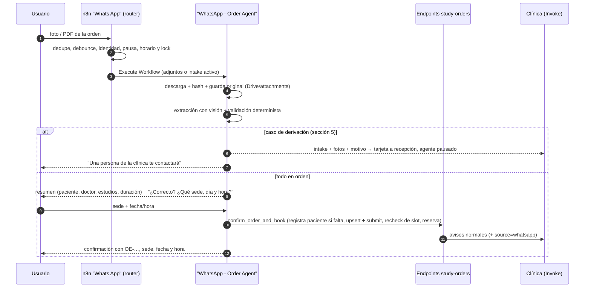

# Órdenes de estudio por WhatsApp — diseño y plan de implementación

> Estado: **Fases 0 a 5 escritas en el repo (nada ejecutado en n8n ni probado en navegador); falta medir la extracción con órdenes reales (compuerta) y la Fase 6 (QA y despliegue)** · Rama: `orden-servicio` · Fecha: 2026-09-30
> **Actualización 2026-10-05 — Separación de workflows:** el agente de órdenes ya no vive dentro de `Whats App`. Quedó en el workflow **`WhatsApp - Order Agent`** (`docs/n8n-flows/WhatsApp - Order Agent.json`), que el router del workflow normal invoca con **Execute Workflow**; los 6 webhooks `agent-tools/order-*` quedaron embebidos ahí. Ver §15.
> Documento de partida: artefacto "Órdenes de Estudio por WhatsApp" (Parte A funcional, Parte B diseño técnico).
> Este documento recoge las decisiones tomadas tras revisar el código real de `docs/n8n-flows/Whats App.json` y `scripts/n8n/`.

## 1. Objetivo

Que una persona escriba al WhatsApp de la clínica, mande la orden de estudio (foto o PDF) y termine con la cita agendada **sin intervención humana** cuando todo está en orden. El agente debe:

1. Registrar al paciente si no está registrado.
2. Leer la orden y extraer los estudios (y, como referencia, el nombre del doctor que figura en ella).
3. Preguntar sede, fecha y hora.
4. Crear la orden en Invoke (igual a la que crea un doctor en el portal) y agendar la cita.
5. Guardar las fotos originales para auditoría.
6. **Derivar a un humano solo en los casos definidos en la sección 5.**

La orden que llega por WhatsApp es una orden normal de Invoke. A partir de ahí se reusa todo el circuito existente (`upsert`, `submit`, bandeja, notificaciones, `recompute`, `reschedule`, `cancel`). El agente es otro canal de entrada, no un flujo paralelo.

## 2. Decisiones tomadas

| # | Tema | Decisión |
| --- | --- | --- |
| D1 | Arquitectura | **Dos workflows**: `Whats App` (general, con un **router determinista**) y **`WhatsApp - Order Agent`** (ingesta, extracción y agente de órdenes), que el router invoca con **Execute Workflow**. No hay switch de "personalidad" elegido por el usuario. |
| D2 | Doctor y técnico | **Ninguno es obligatorio.** El doctor es quien crea la orden y el técnico quien la ejecuta, pero la orden de WhatsApp se crea sin doctor derivador y su cita sin técnico (recepción lo asigna después). El nombre del doctor que figura en el papel se guarda como texto de referencia (`referring_doctor_name`), sin vincularlo a ningún usuario. No se busca ni se valida al doctor. |
| D3 | Paciente distinto del remitente (ej. un padre manda la orden de su hijo) | **Derivar a un humano.** |
| D4 | Sede | **La elige el usuario**: el agente lista las sedes con su dirección y el usuario escoge la que quiera o la que le quede más cerca. No se elige automáticamente. |
| D5 | Precio | Fuera del primer corte. |
| D6 | Revisión humana | Solo en los casos de la sección 5. El camino feliz no la requiere. |
| D7 | Vigencia de la orden y firma | No derivan. Se registran en el intake y quedan configurables. |
| D8 | Usuario de servicio | El agente crea órdenes con un usuario "Agente WhatsApp" (rol `agente_ia`) vía los endpoints existentes, no con SQL duplicado. |

Sobre D4: las sedes no guardan coordenadas (el mapa las geocodifica en el navegador), así que "la más cercana" lo resuelve el usuario leyendo las direcciones. El agente puede sugerir según la zona que el usuario mencione. Calcular cercanía con el mensaje de ubicación de WhatsApp queda como mejora futura.

## 3. Qué hay hoy (verificado en el código)

**Reutilizable tal cual:** debounce de 30 s, dedupe por `wamid`, lock por teléfono, horario del agente, pausa humana, modo test con lista blanca, `handoff_to_human`, `Agent_Availability2` (acepta `durationInMinutes` y `calendarSourceIds`), el circuito completo de órdenes y el subflujo `Attachements CRUD` (Google Drive + tabla `attachments` con `source_name`/`source_id`).

**Limitaciones que este proyecto resuelve:**

| Hoy | Consecuencia | Fase |
| --- | --- | --- |
| Solo procesa `text.body`; imagen y PDF se descartan | Hay que construir la ingesta | 2 |
| Un único prompt: servicio siempre "Consulta general", nunca pregunta sede, no agenda si ya hay una cita pendiente | Incompatible con órdenes (que pueden necesitar varias citas) | 4 |
| `Resolve Patient Identity`: `WHERE phone_number = $1 LIMIT 1` sin orden | Con teléfonos repetibles puede devolver a cualquier usuario y exponer su cuenta | **0** |
| `register_patient` solo guarda nombre, teléfono y email (sin CI); el `patient_id` nuevo no sirve en el mismo turno | Insuficiente para órdenes | 4 |
| Los 8 webhooks `agent-tools/*` no tienen autenticación y confían en el `patient_id` del body | Cualquiera que conozca la URL puede leer/crear datos | **0** |
| `study_orders.doctor_id` es `NOT NULL` y el `upsert` usa al usuario del token como doctor si no se indica otro | Una orden sin doctor quedaría a nombre del Agente WhatsApp | 1 |
| `public-book` no valida superposición de citas en el calendario | Doble reserva | **0** |
| La página pública valida slots de 30 min pero reserva la duración completa | Superposición en órdenes largas | **0** |
| Los tokens JWT de Invoke no llevan `exp` | Un JWT de servicio no caduca: se revoca quitando el rol al usuario o rotando el secreto | **0** |

## 4. Arquitectura



Las respuestas que llegan al usuario las envía siempre el workflow `Whats App` (el de órdenes solo devuelve el texto).

### 4.1 Router

Tras `Combine Buffered Messages`: si el lote trae imagen o PDF, o el teléfono tiene un intake activo, va al **agente de órdenes**. Si no, al **general**. Comparten el lock, la memoria por teléfono y la pausa humana. Si el intake se abandona o expira, el router vuelve al general. El agente de órdenes conserva `get_clinic_info` y `list_sedes` para preguntas sueltas. **Desde la separación (2026-10-05)**, el router ejecuta el workflow `WhatsApp - Order Agent` con **Execute Workflow** y este devuelve la respuesta; el envío, el tracking y el lock siguen en `Whats App`.

### 4.2 Estado del intake

Tabla `whatsapp_order_intakes` (Fase 1). Estados: `extracting`, `needs_input`, `awaiting_confirmation`, `order_created`, `booked`, `handed_off`, `abandoned`, `failed`. Guarda los adjuntos, la extracción cruda, la validación, la orden creada y la cita. `Build Agent Context` inyecta el intake activo en el prompt, así el agente retoma en el paso correcto aunque pasen horas. La memoria de 10 mensajes del LLM no sostiene este flujo.

### 4.3 Herramientas del agente de órdenes

El LLM nunca elige `patient_id`, `order_id` ni tokens. Salen del contexto y del intake.

| Herramienta | Qué hace |
| --- | --- |
| `get_order_intake` | Estado del intake activo: estudios resueltos, faltantes. |
| `answer_intake` | Completa un dato faltante o confirma/corrige una línea dudosa y revalida. |
| `list_order_sedes` | Sedes activas con dirección; el usuario elige una. |
| `list_order_slots` | Horarios libres de la sede elegida, con la **duración total** de la orden. |
| `confirm_order_and_book` | Idempotente por intake: alta del paciente si falta → `upsert` + `submit` → recheck del slot → reserva. Si el slot ya no está, devuelve alternativas y el intake sigue abierto (la orden no se duplica). |
| `handoff_order` | Deriva con un código de motivo (sección 5). |
| `get_clinic_info`, `list_sedes` | Se conservan. |

### 4.4 Autenticación

- **Webhooks `agent-tools/*`:** credencial Header Auth de n8n (secreto compartido). Las herramientas HTTP del agente envían el header. Son llamadas internas de n8n a n8n.
- **Endpoints de órdenes (`jwtAuth`):** el agente usa un JWT del usuario "Agente WhatsApp" con rol `agente_ia` y permisos mínimos (`STUDY_ORDERS_CREATE`, `CREATE_FOR_DOCTOR`, `SUBMIT`, `SCHEDULE`, `VIEW_ALL`, `SEARCH_PATIENT`). **No** incluye `CANCEL`, `ACKNOWLEDGE` ni `DELETE`.
- `wa-message-received` y `wa-message-sent` siguen públicos (los llama YCloud, que no puede mandar un header propio). Su protección (firma del webhook) se evalúa aparte.

## 5. Cuándo se deriva a un humano

Reglas fijas en código, no criterio del LLM:

| Código | Situación | Acción |
| --- | --- | --- |
| `service_not_found` | Algún estudio no mapea a un servicio activo del catálogo | Derivar la orden **completa**. Nunca se agenda parcial. |
| `unreadable` | No es una orden, está ilegible o faltan nombre o CI del paciente | Pedir reenvío una vez; si persiste, derivar. |
| `low_confidence` | Línea con confianza baja que sigue dudosa tras repreguntar | Derivar. |
| `patient_mismatch` | El paciente de la orden no es el remitente (D3) | Derivar. |
| `booking_failed` | Dos fallos de reserva seguidos o error del sistema | Derivar. |
| `user_request` | El usuario pide hablar con una persona | Derivar (ya existe). |

**Qué hace la derivación:**
- Guarda el intake con las fotos y el motivo.
- Pausa el agente para ese teléfono (pausa humana existente).
- Avisa a recepción con una tarjeta que enlaza las fotos y la extracción.
- Le dice al usuario, en una frase, que una persona de la clínica lo contactará.

## 6. Guardado para auditoría

- **Originales:** se descargan al recibirlos (los links de YCloud vencen) y se suben por `Attachements CRUD` (Drive + `attachments`). Se guarda sha256, mime, tamaño, `wamid` y fecha. Se conservan también los de intakes derivados o abandonados.
- **Reproducibilidad:** en el intake quedan la extracción cruda, la validación, el modelo y la versión del prompt. Nunca se sobrescriben.
- **Vínculo:** `study_orders.source = 'whatsapp'` y `source_intake_id`.
- **Visibilidad:** el detalle de la orden muestra las fotos originales junto al resumen extraído.
- **Datos de salud:** el proveedor del modelo de visión debe cumplir las condiciones de tratamiento de datos de la clínica; se define plazo de retención y quién puede ver los originales.

## 7. Seguridad

- El contenido de la imagen es **entrada no confiable**. El LLM conversacional recibe el resultado ya validado, nunca el archivo. Los textos libres extraídos (`notes`, `aclaracion`) se pasan como datos, con longitud acotada, nunca como instrucciones.
- Un doctor solo ve las órdenes donde es derivador; eso no cambia.
- Horas siempre en `America/Montevideo` explícito, no `new Date()` con la zona del servidor.
- El token de agendamiento, si se usa, no entra al contexto del LLM.

## 8. Fases

| Fase | Contenido | Criterio de salida |
| --- | --- | --- |
| **0 · Base** | Autenticar `agent-tools`; usuario y rol `agente_ia` + JWT; resolución de teléfono sin ambigüedad; validar superposición en `public-book`; corregir la duración en la página pública. | Nada expuesto sin secreto. |
| **1 · Datos** | Migración: `whatsapp_order_intakes`, columnas de adjunto en el buffer y los mensajes, `study_orders.source` y `source_intake_id`, tipo de notificación para derivaciones. | Esquema versionado en `database/scripts/`. |
| **2 · Adjuntos** | Filtro de imagen y PDF, debounce con varios archivos, descarga, hash y almacenamiento; respuesta para audio o archivos excedidos. | Varias fotos de una orden forman un solo intake. |
| **3 · Extracción y validación** (sin chat) | Subflujo de visión con salida estructurada y validador determinista. Se prueba offline con 30–50 órdenes reales anonimizadas. | **Compuerta:** aciertos por línea y por orden medidos antes de conectar el chat. |
| **4 · Agente de órdenes** | Router, segundo agente y prompt, herramientas de 4.3. Se prueba en modo test. | Camino feliz completo contra DEV con la lista blanca. |
| **5 · Recepción** | Etiqueta "WhatsApp", filtro "Derivadas", tarjeta de derivación con visor de fotos, `change` en la tarjeta. | Recepción resuelve una derivación sin salir de Invoke. |
| **6 · QA y despliegue** | Casos nuevos en `docs/qa/whatsapp-agent-test-battery.xlsx` (desde WA-049), actualizar WA-014, piloto con lista blanca y el flag `whatsapp_orders_enabled`. | Activación por clínica. |

**Fuera del primer corte:** precio, doctor como remitente, dependientes, mensajes interactivos, relación servicio → sede/equipo, cercanía por ubicación.

## 9. A verificar antes de la Fase 4

1. **`doctorId` en `Agent_Availability2`:** el doctor de la cita es el derivador, no quien ejecuta el estudio. Si el subflujo lo usa, bloquearía horarios por consultas del doctor. Debe ir vacío.
2. **Ruta de agendado:** `public-book` (simple, sin Google Calendar) o `appointments/upsert` + `link-appointment` (lo que hace recepción, con sincronización).
3. **Unicidad de teléfono y CI** en `users` y el endpoint de alta con `identity_document_type`.
4. **YCloud:** formato del payload de imagen/documento y vigencia del link de descarga.
5. **`Agent_Availability2` está pensado para consultas con doctor, y quitar el doctor de la orden NO lo resuelve.** Su modo "listar" arma los huecos a partir de la disponibilidad de los *doctores* (`ids_disponibles`) y descarta a quien ya es `assignee_id` de una cita solapada. En una orden el `assignee_id` es el derivador, que no ejecuta el estudio: sus horarios de consulta no deberían condicionar ni bloquear un estudio. Para la Fase 4 hace falta una fuente de huecos basada en la **disponibilidad del calendario** (y, si aplica, del técnico), no del derivador. Verificado en el código: `Get_possible_schedules` descarta cualquier horario en el que ningún doctor figure disponible en su tabla de disponibilidad, aunque el calendario esté libre. Por eso, aunque la orden y la cita no lleven doctor, el modo listar sigue dependiendo de los doctores. Esto afecta igual al link público actual. Es el mayor riesgo técnico pendiente.
6. **Varias sedes con equipos distintos:** como la sede la elige el usuario, un estudio podría caer en una sede sin el equipo. Sin tabla servicio → sede no hay forma de impedirlo; se acepta en el primer corte y se documenta.

## 10. Fase 0 — cambios y puesta en marcha

### Qué se hizo

| Cambio | Archivo |
| --- | --- |
| Los 8 webhooks `agent-tools/*` exigen Header Auth y las 8 herramientas HTTP del agente envían el header | `docs/n8n-flows/Whats App.json` |
| Resolución de identidad por teléfono sin ambigüedad: ya no hace `LIMIT 1` a ciegas. Prefiere usuarios activos y, si queda más de uno, no elige ninguno (`phone_ambiguous`) | `Resolve Patient Identity`, `Build Agent Context` |
| Prompt: con `phone_ambiguous=true` el agente no registra ni toca cuentas y deriva a recepción | `Whatsapp Agent1` (system message) |
| `public-book` rechaza la reserva si se superpone con otra cita no cancelada del mismo calendario (responde 409) | `scripts/n8n/study-orders-sql.mjs`, `n8n-workflows/study-orders-public-book.json` |
| La página pública consulta disponibilidad con la duración total de los estudios (antes, 30 min) | `src/app/[locale]/orden/[token]/page.tsx` |
| Rol `agente_ia`, usuario "Agente WhatsApp" y 7 permisos mínimos | `database/scripts/122_20260930_whatsapp-agent-service-user.sql` |
| Generador del JWT del usuario de servicio | `scripts/n8n/generate-agent-jwt.mjs` |

### Pasos manuales para ponerlo en marcha (en este orden)

1. **n8n — credencial Header Auth** llamada `WhatsApp Agent Tools Header Auth`: nombre del header `X-Agent-Key`, valor un secreto aleatorio largo.
2. **Importar `Whats App.json`.** El JSON trae un id de credencial de relleno (`REPLACE_WITH_AGENT_TOOLS_HEADER_AUTH_ID`): en los 8 webhooks `agent-tools/*` y en las 8 herramientas HTTP hay que elegir la credencial del paso 1. Hasta hacerlo, esos webhooks no se activan. **No importar sin haber creado la credencial**, porque el agente dejaría de funcionar.
3. **Aplicar la migración 122** en DEV, luego en las demás bases.
4. **Importar `study-orders-public-book.json`.**
5. **Generar el JWT del agente** con `scripts/n8n/generate-agent-jwt.mjs` y guardarlo como credencial de n8n. Todavía no lo usa ningún nodo; se usará en la Fase 4.
6. Verificar: llamar a `agent-tools/check-availability` sin header (debe dar 403) y con header (200); escribir al WhatsApp desde un número con datos repetidos.

### Límites conocidos

- **`public-book` reduce la carrera, no la elimina**: la sentencia SQL lee una foto anterior a su propio `INSERT`, así que dos reservas simultáneas al mismo calendario pueden pasar. Quien reserva debe rechequear la disponibilidad justo antes (está previsto en `confirm_order_and_book`). Cerrarlo del todo exigiría un bloqueo por calendario en una transacción explícita.
- **`/study-orders/reschedule` tampoco valida superposición.** Se revisa en la Fase 1 (reagendar desde WhatsApp).
- **`wa-message-received` / `wa-message-sent` siguen sin autenticación**: los llama YCloud y no admite un header propio. Queda pendiente evaluar la verificación de firma del webhook.
- **El JWT de servicio no caduca** (ver la cabecera de la migración 122 para cómo cortarlo).
- **Coste de la ambigüedad:** un número compartido por varios usuarios (p. ej. una familia) queda derivado a recepción en vez de atendido por el agente. Es deliberado.
- **Dependientes y teléfonos repetibles:** hoy no hay teléfonos duplicados en DEV; la regla protege el caso en que se activen.

## 11. Doctor y técnico opcionales (decisión posterior a la Fase 0)

Revisado el código: casi todo el circuito ya tolera una orden sin doctor.

| Pieza | Estado |
| --- | --- |
| Lecturas (bandeja, detalle, citas, tablero) | Usan `LEFT JOIN users` sobre el doctor: devuelven `doctor_name` nulo. |
| Aviso al doctor (`NOTIFY_DOCTOR_SQL`) | Ya filtra `doctor_id IS NOT NULL`: sin doctor no se envía. |
| Autorizaciones (`doctor_id = $1 OR VIEW_ALL / SCHEDULE`) | Con `NULL` la primera rama es falsa y decide el permiso: correcto. |
| `public-book` | Copia `doctor_id` a `assignee_id`: con `NULL` la cita queda sin doctor. |
| Tipos del front (`doctor_id?`, `doctor_name?: string \| null`) | Ya admiten nulo. |
| Columna `study_orders.doctor_id` | **`NOT NULL`: hay que hacerla opcional (migración, Fase 1).** |
| `UPSERT_SQL` | **Si el body no trae doctor, usa al usuario del token.** Hay que permitir explícitamente "sin doctor" (un indicador en el body, honrado solo con `CREATE_FOR_DOCTOR`). |
| Técnico | `appointments.technician_id` ya es opcional. |

Consecuencias:

- El rol `agente_ia` **conserva** `STUDY_ORDERS_CREATE_FOR_DOCTOR`: es el permiso que autoriza a crear la orden sin doctor propio.
- Sin derivador, el doctor no recibe avisos de avance ni ve la orden en "Mis Órdenes". Recepción la ve en la bandeja de Órdenes.
- Las órdenes creadas por un doctor en el portal siguen llevando su doctor; nada cambia ahí.

## 12. Fase 1 — datos

### Qué se hizo

| Cambio | Archivo |
| --- | --- |
| `study_orders.doctor_id` opcional; columnas `source` (`portal`/`whatsapp`), `referring_doctor_name` y `source_intake_id` | `database/scripts/123_20260930_whatsapp-study-order-intake.sql` |
| Columnas de adjunto en `whatsapp_inbound_buffer` (`media_kind`, `media_id`, `media_url`, `media_mime`, `media_filename`, `media_caption`) y en `whatsapp_conversation_messages` (`media_kind`, `media_attachment_id`) | ídem |
| Tabla `whatsapp_order_intakes` (estados, originales por referencia, extracción cruda, validación, derivación, sede y horarios ofrecidos, cita) con un único intake activo por teléfono | ídem |
| Claves `whatsapp_orders_enabled` (nace en `false`), `whatsapp_orders_min_confidence` (`0.85`) y `whatsapp_orders_intake_ttl_hours` (`24`) | ídem |
| `POST /study-orders/upsert` acepta `without_doctor`, `source`, `referring_doctor_name` y `source_intake_id`. Los cuatro se ignoran sin `STUDY_ORDERS_CREATE_FOR_DOCTOR` | `scripts/n8n/study-orders-sql.mjs`, `generate-study-order-workflows.mjs`, `n8n-workflows/study-orders-upsert.json` |

### Decisiones de diseño

- **Originales fuera de la tabla.** Se guardan en Drive vía `Attachements CRUD` (`attachments.source_name = 'whatsapp_order_intake'`, `source_id` = id del intake). El intake guarda solo referencias (`attachment_id`, sha256, mime, tamaño, `wamid`).
- **Derivación sin tipo de notificación nuevo.** Se reutiliza `whatsapp_handoff_requested`, que `notifications_type_check` ya admite.
- **Sin campo `needs_review`.** La revisión humana solo existe en las derivaciones, que quedan en el intake (`status = 'handed_off'` + `handoff_reason`). Una restricción obliga a que ambos vayan juntos.
- **Quitar el doctor no es retroactivo:** las órdenes del portal siguen llevando el doctor que las creó.

### Pasos manuales

1. Aplicar `122` y luego `123` en DEV (después en las demás bases). **Aplicar `123` antes de importar `study-orders-upsert.json`**: el SQL nuevo escribe columnas que solo existen tras la migración.
2. Importar `study-orders-upsert.json`.
3. Numeración: 122 y 123 se eligieron porque son las siguientes libres en esta rama. Si la rama con 120 y 121 pendientes ya usa esos números, renumerar antes de fusionar.

### No verificado

- Las migraciones 122 y 123 no se ejecutaron (DEV es compartido y el acceso es de solo lectura); validé los nombres de tablas y columnas contra la base, pero no la ejecución.
- El `upsert` modificado tampoco se ejecutó, por depender de 123.

## 13. Fase 2 — ingesta de adjuntos

### Lo verificado de YCloud

- El evento `whatsapp.inbound_message.received` trae `image` o `document` con `id`, `link`, `mime_type`, `sha256` (base64), `caption` y, en documentos, `filename`.
- El `link` se puede abrir unos minutos sin credenciales y **hasta 30 días con el header `X-API-Key`**. No vence al instante como se temía, pero igual se baja y se guarda en cuanto se procesa el lote.
- Como YCloud informa el sha256 del original, se compara con el de la descarga para detectar archivos corruptos (`hash_mismatch`).

Fuente: [WhatsApp Inbound Message Webhook Examples (YCloud)](https://docs.ycloud.com/reference/whatsapp-inbound-message-webhook-examples).

### Qué se hizo en `docs/n8n-flows/Whats App.json`

| Paso | Nodo | Cambio |
| --- | --- | --- |
| Flag | `Get WhatsApp Agent Config` | Lee `whatsapp_orders_enabled` (por defecto `false`). |
| Entrada | `Filter & Extract Inbound Message` | Reconoce imagen (JPEG/PNG/WebP) y PDF; devuelve `is_processable` y los datos del adjunto. Audio, video, stickers y otros documentos se siguen ignorando. Con el flag apagado todo se comporta como antes. |
| Compuerta | `Is Processable Message?` (antes `Is New Text Message?`) | Usa `is_processable`. |
| Buffer | `Buffer Inbound Message`, `Dedupe Check`, `Claim Batch If Latest`, `Combine Buffered Messages` | Guardan y reclaman los adjuntos del lote. El lote devuelve `has_media` y `media` (máximo 6 archivos; el resto se cuenta en `media_overflow`). |
| Rama | `Has Media?` | Si el lote trae adjuntos va a la rama nueva; si no, sigue por el camino de siempre. |
| Intake | `Get Or Create Intake` | Un intake en curso por teléfono: si existe se reutiliza y se renueva su vigencia (varias fotos → un solo intake). |
| Descarga | `Split Media Files` → `Download Media` | Un ítem por archivo; descarga con la credencial `YCloud API KEY`. |
| Validación | `Validate Media` | Descarta por: descarga fallida, archivo vacío, más de 10 MB, tipo distinto del anunciado o hash que no coincide. Calcula sha256, tamaño y nombre. |
| Guardado | `Call 'Attachements CRUD' (Order Original)` | Sube el original a Drive y lo registra en `attachments` con `source_name = whatsapp_order_intake` y `source_id` = id del intake. |
| Registro | `Entry (stored)` / `Entry (rejected)` → `Append Media To Intake` | Agrega una referencia por archivo a `whatsapp_order_intakes.media`, **incluidos los descartados con su motivo**. |

### Lo que la Fase 2 NO hace (queda para las siguientes)

- **No responde al usuario.** La rama termina al guardar los originales; nadie lee la orden todavía (Fase 3) ni contesta (Fase 4). **El flag `whatsapp_orders_enabled` debe seguir en `false` hasta la Fase 4**, o el usuario que mande una foto no recibiría respuesta.
- **Audio, video y documentos que no sean PDF** siguen ignorados. La respuesta explicativa ("solo puedo leer imágenes y PDF") y el aviso de archivo demasiado grande se agregan en la Fase 4, porque necesitan pasar por el lock, el horario y la pausa humana.
- **Los adjuntos se guardan aunque la conversación esté pausada o fuera de horario**, porque la descarga no depende del agente. El router de la Fase 4 decidirá qué hacer con un intake de una conversación pausada.
- **`Track Inbound Activity` no se ejecuta para lotes con adjuntos**, así que `whatsapp_conversation_activity.last_message_at` no se actualiza. Se corrige al conectar el router (Fase 4).
- **Texto enviado junto con la foto:** el pie de foto queda en `media[].caption`, pero un texto suelto del mismo lote no llega todavía al agente.
- **Nueva foto con un intake ya avanzado:** si el intake está en `awaiting_confirmation` u `order_created`, la foto se suma a ese intake. La Fase 3/4 decide si eso abre uno nuevo.

### Puesta en marcha

1. Aplicar la migración 123 (agrega también `media_sha256` al buffer).
2. Importar `Whats App.json` (después de crear la credencial Header Auth de la Fase 0).
3. Comprobar que el id del workflow `Attachements CRUD` en el nodo `Call 'Attachements CRUD' (Order Original)` (`TTwyLGp8Gg9qDKdn`, el mismo que usa `Clinic History Workflows`) corresponde a la instancia de n8n.
4. Con el flag en `false`, verificar que una foto sigue recibiendo el 200 "ignored" de siempre.
5. En modo test (lista blanca), poner el flag en `true`, mandar una foto y un PDF y comprobar: una fila en `whatsapp_order_intakes`, una fila por archivo en `attachments` y las referencias en `media`. Volver el flag a `false`.

### No verificado

- Probé con datos simulados la lógica del filtro (texto, imagen, PDF, .doc y audio, con el flag encendido y apagado) y la validación (`ok`, `hash_mismatch`, `unexpected_mime`), y el JavaScript de los nodos compila. **No corrí el workflow en n8n**: ni la descarga real, ni la llamada a `Attachements CRUD`, ni las consultas nuevas.
- Supuestos a confirmar en la primera prueba: que `Attachements CRUD` devuelve `{ success, data: { id } }` para cada archivo y en el mismo orden, y que el nodo `Execute Workflow` le pasa el binario.

## 14. Fase 3 — extracción y validación

### Piezas

| Pieza | Archivo |
| --- | --- |
| Lógica pura: esquema de extracción, prompt y **validador determinista** | `scripts/n8n/study-order-intake/intake-lib.mjs` |
| 25 pruebas del validador y del esquema (`node --test scripts/n8n/study-order-intake/intake-lib.test.mjs`) | `intake-lib.test.mjs` |
| Generador del subflujo n8n | `scripts/n8n/generate-study-order-intake-workflow.mjs` |
| Subflujo generado, listo para importar | `n8n-workflows/whatsapp-study-order-intake.json` |
| Medición offline contra órdenes reales (la compuerta) | `scripts/n8n/study-order-intake/eval-extraction.mjs` |
| Clave `whatsapp_orders_vision_model` | migración 123 |

### Cómo funciona el subflujo `WhatsApp - Study Order Intake`

Entrada: `intake_id`, `mode` (`extract` o `revalidate`) y `answers` (JSON con `confirmed`, `removed`, `overrides`).

1. **Carga el contexto en una consulta:** el intake, sus originales (`attachments`), el catálogo vigente (los servicios activos de las categorías `ci-orden:cat:*`, que es lo que muestra el asistente de órdenes), las opciones del formulario y la configuración.
2. **`extract`:** baja los originales de Drive, arma un pedido al modelo con imágenes y PDF y exige **salida estructurada estricta**. Los ids de servicio son un `enum` del catálogo vigente: el modelo no puede inventar un servicio.
3. **`revalidate`:** no vuelve a llamar al modelo. Revalida la extracción guardada con lo que el usuario respondió (confirmó una línea, descartó otra, corrigió la cédula).
4. **Busca solo lo necesario:** usuarios con la cédula leída y las órdenes abiertas de ese paciente (últimos 30 días).
5. **Valida (código, no LLM)** y guarda en el intake: estado, extracción cruda, validación (con `prior`, lo ya preguntado), modelo, versión del prompt y tokens.
6. **Devuelve** `outcome` (`ready`, `needs_input` o `handoff`), `questions`, `warnings`, `patient`, `resolved` (lo que se enviaría a `upsert`) y `duplicate_of`.

### Reglas del validador

| Situación | Resultado |
| --- | --- |
| Falla del modelo | `handoff` · `system_error` |
| Teléfono asociado a más de un usuario | `handoff` · `patient_mismatch` |
| Sin archivos utilizables, no es una orden o está ilegible | Pide reenvío una vez (`needs_input`); la segunda vez, `handoff` · `unreadable` |
| Algún estudio no figura en el catálogo (o el modelo lo dejó en `unmatched_text_lines`) | `handoff` · `service_not_found` para **toda** la orden |
| Falta el nombre o la cédula, o la cédula uruguaya tiene dígito verificador inválido | Se pregunta una vez; si sigue mal, `handoff` · `unreadable` (los pasaportes no se validan) |
| El paciente de la orden no es quien escribe (otra cédula, nombre distinto, cédula de otro teléfono o duplicada) | `handoff` · `patient_mismatch` |
| Línea con confianza menor al umbral | Se pregunta por esa línea; si sigue dudosa, `handoff` · `low_confidence` |
| Sin firma, fecha antigua, detalles que no encajan en el formulario | Advertencia; **no** deriva |
| Mismos estudios que una orden abierta del paciente | `duplicate_of` (la Fase 4 decide ofrecer esa orden) |
| Todo en orden | `ready`, con la orden armada y la duración total |

Lo que el formulario no puede representar (una opción desconocida, una pieza dentaria inválida) **no se pierde**: va a `clinical_notes` junto con el doctor y la fecha del papel.

El doctor se transcribe como texto (`referring_doctor_name`); no se busca ni se vincula (decisión D2).

### Cómo medirla (la compuerta)

1. Reunir 30 a 50 órdenes **reales y anonimizadas** (fotos y PDF, manuscritas e impresas) en una carpeta **fuera del repo**, cada una con su `.expected.json`.
2. Exportar el catálogo y las opciones a `catalog.json` (`{ "catalog": [...], "options": [...] }`):

```sql
-- catalog
SELECT s.id, COALESCE(s.external_id, 'id:' || s.id) AS external_id, s.name,
       c.code AS section_code, s.duration_minutes
  FROM service_catalog s JOIN miscellaneous_categories c ON c.id = s.category_id
 WHERE c.external_id LIKE 'ci-orden:cat:%' AND s.is_active ORDER BY c.code, s.id;
-- options
SELECT o.option_kind, o.code, o.label, o.section_code, o.group_code, o.input_type,
       COALESCE(sv.external_id, 'id:' || sv.id) AS service_external_id
  FROM study_order_options o LEFT JOIN service_catalog sv ON sv.id = o.service_id
 WHERE o.is_active ORDER BY o.sort_order;
```

3. Correr `OPENAI_API_KEY=... node scripts/n8n/study-order-intake/eval-extraction.mjs --catalog catalog.json --dir ./muestras`.
4. **Criterios para pasar a la Fase 4** (propuestos; los define la clínica):
   - Órdenes que debían derivarse y salieron `ready`: **0**.
   - Precisión por línea ≥ 98 % (un estudio de más es el error más caro: se agendaría algo no pedido).
   - Cédula correcta ≥ 95 %.
   - Lectura exacta por orden: la meta la fija la clínica según cuánta revisión humana tolere.
   - Comparar con otro modelo si no se alcanza.

### Lo que hay que saber

- **El modelo por defecto es el del agente (`gpt-5.6-luna`) y no verifiqué que admita imágenes ni PDF.** Es la decisión abierta 5 del artefacto original. Si no los admite, basta cambiar `whatsapp_orders_vision_model` (el subflujo no cambia).
- **Datos de salud:** las órdenes salen al proveedor del modelo. Confirmar con la clínica sus condiciones de tratamiento de datos antes de activar el flag.
- **Las instrucciones escritas dentro de una orden no se obedecen**: el prompt lo indica, el modelo solo transcribe y la salida se valida contra esquema y catálogo. Es una defensa, no una garantía; por eso la decisión final nunca la toma el LLM conversacional.
- **Probado:** el validador (25 pruebas), la generación del esquema estricto y el código de los nodos con datos simulados (incluida la segunda vuelta "cédula inválida → corrección del usuario → `ready`"). Las consultas nuevas se ejecutaron en DEV en modo lectura para comprobar la sintaxis.
- **No probado:** la ejecución real en n8n (descarga de Drive, llamada a OpenAI con imágenes y PDF, guardado en el intake, que necesita la migración 123) y, sobre todo, **la precisión de lectura sobre órdenes reales**. Hasta medirla, no hay datos para decidir si el flujo puede ir sin revisión humana.

## 15. Fase 4 — router y agente de órdenes

### Resumen

**Dos workflows** desde la separación (2026-10-05): `Whats App` conserva la entrada pública y el pipeline compartido (dedupe, debounce, identidad, pausa, horario, lock y router); el agente de órdenes y toda su ingesta viven en **`WhatsApp - Order Agent`**, que el router invoca con **Execute Workflow** y devuelve la respuesta para que `Whats App` la envíe y registre. Los horarios salen de una lógica propia (no de `Agent_Availability2`).

| Pieza | Dónde |
| --- | --- |
| Entrada, dedupe/debounce, identidad, pausa, horario, lock, router (`Route To Orders?` → `Run Orders Agent`) y respuesta a formatos no soportados | `docs/n8n-flows/Whats App.json` |
| Ingesta de adjuntos, extracción, `Order Agent`, sus 6 herramientas, continuación tras guardar los originales y respuesta fija de derivación | `docs/n8n-flows/WhatsApp - Order Agent.json` |
| Webhooks `agent-tools/order-*` (93 nodos, generado) — **ahora embebidos** en `WhatsApp - Order Agent.json`; `n8n-workflows/whatsapp-order-agent-tools.json` queda solo como referencia y **no se importa** | `scripts/n8n/generate-order-agent-tools-workflow.mjs` |
| Horarios libres (puro, con 11 pruebas) | `scripts/n8n/study-order-intake/slots-lib.mjs` |
| Clave `whatsapp_orders_calendar_ids` | migración 123 |

El snapshot de trabajo `docs/n8n-flows/WhatsApp Agent.json` (unificado + tools mergeados en un solo workflow) también queda obsoleto como fuente: las versiones vigentes son los dos archivos de la tabla.

### Flujo de un mensaje

1. **Entrada y pipeline compartido** (`Whats App`, flag encendido): imagen/PDF se consideran "procesables" y se bufferizan con sus metadatos. Pasa por la lista blanca del modo test, dedupe, debounce, identidad, pausa, horario y lock. El original **no** se descarga todavía.
2. **Formatos no soportados** (audio, video, sticker, documentos que no son PDF, imágenes que no son JPEG/PNG/WebP), con el flag encendido: respuesta fija pidiendo foto o PDF. Pasa por la lista blanca del modo test y por el dedupe.
3. **Router** (`Route To Orders?`, después del lock): va al workflow de órdenes si el lote trae un archivo o si ese teléfono tiene un intake en curso (`Get Active Intake`), y solo con `whatsapp_orders_enabled = true`. Si no, al agente general de siempre.
4. **`WhatsApp - Order Agent`** (Execute Workflow): si el lote trae archivos → se vencen los intakes inactivos (`Expire Old Intakes`) → se guardan los originales (Fase 2) → **extracción + validación** (subflujo de la Fase 3). Si el resultado es **derivación**: `order-handoff` marca el intake, avisa a recepción (reutiliza `agent-tools/handoff`: pausa la conversación y notifica con el motivo y el link del primer original) y devuelve al workflow principal el mensaje fijo (no interviene ningún LLM). Si no, sigue al agente.
5. **Agente de órdenes** (`Order Agent`): conversa y agenda con sus herramientas y devuelve el texto al workflow principal, que quita el marcador `<<PENDING:…>>`, lo formatea, lo envía y actualiza tracking, logs y lock.

### Herramientas del agente de órdenes

El modelo nunca maneja ids: todo se resuelve por el teléfono (que sale del contexto, no de lo que escriba el usuario) y por números de lista guardados en `whatsapp_order_intakes.slots_offered`.

| Herramienta | Webhook | Qué hace |
| --- | --- | --- |
| `get_order_intake` | `order-get-intake` | Estado y `next_step` (`wait`, `answer_questions`, `ask_sede_date_time`, `book_slot`), resumen y preguntas numeradas. Se llama primero en cada mensaje. |
| `answer_order_question` | `order-answer` | Traduce la respuesta (sí/no, cédula, nombre) y **revalida** sin volver a llamar al modelo de visión. Si el resultado es derivación, la ejecuta. |
| `list_order_sedes` | `order-list-sedes` | Sedes con agenda y calendarios elegibles, numeradas, con dirección. **La sede la elige el usuario** (D4). |
| `list_order_slots` | `order-list-slots` | Hasta 6 horarios para la **duración total** de la orden, según día/hora pedidos. |
| `confirm_order_and_book` | `order-confirm-and-book` | Registra al paciente si falta → crea la orden **sin doctor** (`without_doctor`, `source = whatsapp`) y la envía → revisa que el horario siga libre → genera el token y reserva con `public-book` → marca el intake como `booked`. Idempotente por intake. |
| `handoff_order` | `order-handoff` | Deriva con motivo y original. |
| `get_clinic_info`, `list_sedes` | (existentes) | Preguntas sueltas. |

La orden de WhatsApp y su cita **no llevan doctor ni técnico** (D2); el nombre del papel queda en `referring_doctor_name`.

### Horarios libres (la lógica nueva)

`Agent_Availability2` no sirve para órdenes (ver sección 9): parte de la disponibilidad de los doctores. `slots-lib.mjs` calcula:

> horario de atención de la **sede** (`clinic_schedules`, se unen filas repetidas) ∩ **calendario activo** de esa sede sin citas solapadas, por la duración total, en pasos de 30 min, desde 4 h de antelación y hasta 14 días.

- Todo en hora de pared de Montevideo, como texto sin zona.
- Los calendarios elegibles se pueden acotar con `whatsapp_orders_calendar_ids` (ids separados por coma; vacío = todos los activos de la sede).
- La antelación mínima de 4 h no es arbitraria: `public-book` compara la hora local contra el reloj del servidor de n8n (UTC) y rechazaría como "pasado" un hueco más cercano a 3 h.

### Fallos y derivación al reservar

- Fallan y **suman un intento** (`booking_attempts`): crear o enviar la orden, el token, la reserva. Con **dos**, la herramienta ordena derivar (`booking_failed`).
- `slot_taken` (el horario se ocupó justo antes): no suma intento ni duplica la orden; el agente ofrece otros.
- Un intake con orden ya creada retoma desde la reserva.

### Puesta en marcha (en este orden)

1. Credenciales en n8n (Header Auth): **`WhatsApp Agent Tools Header Auth`** (`X-Agent-Key`, Fase 0) y **`Invoke Agent Service JWT`** (`Authorization: Bearer <jwt>`, generado con `generate-agent-jwt.mjs`).
2. Migraciones 122 y 123.
3. Importar, en este orden: `whatsapp-study-order-intake.json` → **`WhatsApp - Order Agent.json`** → **`Whats App.json`** (y los demás importados antes). **No importar `whatsapp-order-agent-tools.json`**: sus 6 webhooks quedaron embebidos en `WhatsApp - Order Agent`; si ya está importado, desactivarlo/eliminarlo para no duplicar los paths `agent-tools/order-*`.
4. **Reemplazar los placeholders** `REPLACE_WITH_…`: credenciales Header Auth y JWT; el id del workflow `WhatsApp - Study Order Intake` en **dos** lugares (`Answer: Run Intake Subflow` y `Run Order Extraction`); y el id de `WhatsApp - Order Agent` en el nodo `Run Orders Agent` de `Whats App`.
5. Comprobar `whatsapp_orders_vision_model` y, si hace falta, `whatsapp_orders_calendar_ids`.
6. Probar en modo test (lista blanca) con `whatsapp_orders_enabled = true`; al terminar, volver a `false`.

### Limitaciones conocidas

- **No hay ejecuciones verificadas en n8n**: la separación en dos workflows (2026-10-05) se preparó en el repo y todavía no se desplegó ni probó; el comportamiento del agente (cómo usa las herramientas, el tono, el manejo de errores) **solo se puede validar conversando con él**. El prompt es un primer borrador.
- **Un usuario con una orden en curso queda en el agente de órdenes** hasta que se agende, se derive o pasen 24 h (la vigencia del intake): durante ese tiempo no puede consultar su cuenta ni sus citas por el agente general. El agente de órdenes lo deriva a una persona en esos casos. Un router que distinga la intención es una mejora posible.
- **Horarios:** solo se consideran `clinic_schedules` y las citas del calendario. No hay feriados ni cierres de la clínica en la base que yo haya podido identificar, así que un feriado con horario cargado se ofrecería.
- **Sin relación servicio → sede/equipo:** el usuario puede elegir una sede que no tenga el equipo del estudio (p. ej. Cone Beam). Aceptado en el primer corte.
- **Carrera de reservas:** `public-book` la reduce, no la elimina (ver sección 10).
- **Una orden duplicada** se deriva a una persona; agendar una orden ya existente por WhatsApp no está construido.
- **Cancelar o reagendar** una cita de una orden por WhatsApp (Fase 1 del plan original) **no está construido**; el agente deriva.
- **Conversación pausada o fuera de horario:** desde la separación, la descarga y la extracción ya **no** corren antes de esos controles: el workflow de órdenes se invoca recién después del lock. Un archivo enviado fuera de horario o con la conversación pausada queda sin procesar hasta que llegue un mensaje en condiciones (antes se procesaba igual y podía repetirse el mensaje fijo de "te va a escribir una persona").
- **Duración del lock:** la extracción con visión ahora corre **dentro** del lock (antes corría antes de tomarlo). Si supera `whatsapp_agent_lock_timeout_seconds` (90 s por defecto), otro mensaje del mismo teléfono puede tomar el lock; conviene medirlo en las pruebas y subir el valor si hace falta.
- **Dependencia entre workflows:** con el flag encendido, las órdenes necesitan que `WhatsApp - Order Agent` esté importado y activo (ahí viven los webhooks `agent-tools/order-*`). Con el flag apagado no hay dependencia: todo va al agente general.
- Las respuestas fijas (formato no soportado, derivación) no pasan por la memoria del chat.

### Casos para la batería de pruebas (`docs/qa/whatsapp-agent-test-battery.xlsx`, desde WA-049)

Foto borrosa; orden de otra persona; estudio que no figura en el sistema (debe derivar toda la orden); varias fotos de una orden; PDF; audio y sticker; usuario no registrado (se registra con los datos de la orden); cédula con dígito verificador inválido; teléfono compartido por dos usuarios; horario tomado entre la oferta y la reserva; dos fallas de reserva seguidas; usuario que cambia de sede o de día a mitad de camino; usuario que pide hablar con una persona; orden duplicada; mensaje de otro tema con una orden en curso; instrucciones escondidas dentro de la imagen.

## 16. Fase 5 — recepción en Invoke

Objetivo: que recepción vea las órdenes de WhatsApp sin salir de Invoke, compruebe contra el original que el asistente leyó bien, resuelva las derivaciones y pueda ajustar el asistente sin tocar la base.

### Qué hay

| Pieza | Dónde |
| --- | --- |
| **Etiqueta "WhatsApp"** en la bandeja (columna del número y tarjetas) y en la cabecera del detalle | `whatsapp-source-badge.tsx`, `columns.tsx`, `study-orders-screen.tsx`, `study-order-detail-panel.tsx` |
| **Pestaña "Original"** en el detalle de una orden de WhatsApp: fotos y PDF recibidos (con vista ampliada), teléfono de origen, modelo de lectura, doctor tal como figura en el papel y advertencias de la revisión. Solo con `STUDY_ORDERS_VIEW_ALL` | `study-order-whatsapp-tab.tsx`, `whatsapp-intake-files.tsx` |
| **Vista "Derivadas de WhatsApp"** dentro de Órdenes (clínica): interruptor con contador de pendientes; una tarjeta por derivación con el motivo, paciente, teléfono, estudios leídos, estudios que no figuran en el sistema, detalle y originales; filtro Pendientes / Resueltas / Todas; **Marcar como resuelta** con nota opcional (requiere `STUDY_ORDERS_ACKNOWLEDGE`) | `whatsapp-intakes-panel.tsx` |
| **Aviso de derivación**: la tarjeta del asistente muestra el motivo de la orden y un botón a la vista anterior (`?view=whatsapp`) | `notification-card.tsx` |
| **Aviso de orden nueva**: distingue "Recibida por WhatsApp" (sin doctor derivador), "anulada" y "el paciente agendó por su cuenta" (antes los tres se veían igual) | `notification-card.tsx`, `notifications-context.tsx` |
| **Ajustes** en Sistema → Agente de WhatsApp: activar las órdenes, modelo de lectura, confianza mínima, calendarios elegibles y vigencia | `whatsapp-orders-settings-card.tsx` |

### Backend (n8n + SQL)

| Endpoint | Para qué |
| --- | --- |
| `GET /study-orders` | Ahora devuelve `source` y `referring_doctor_name`, y acepta `source=whatsapp` |
| `GET /study-orders/detail` | Ahora devuelve `source`, `referring_doctor_name`, `source_intake_id` y `whatsapp` (originales, advertencias, modelo) |
| `GET /study-orders/whatsapp-intakes` (nuevo) | Derivaciones, con estudios leídos y originales. Solo `STUDY_ORDERS_VIEW_ALL` |
| `POST /study-orders/whatsapp-intakes/resolve` (nuevo) | Marca una derivación como resuelta. Solo `STUDY_ORDERS_ACKNOWLEDGE`. No toca los originales ni la extracción |
| `GET /study-orders/whatsapp-intakes/file?intake_id=&id=` (nuevo, `study-orders-whatsapp-file.json`) | Devuelve el original desde Drive. El SQL exige archivo + intake + permiso a la vez: con el id de un adjunto de otro módulo no baja nada |
| Notificaciones de órdenes | La metadata lleva `source` y `referring_doctor_name` |

Migración 123: columnas `resolved_at`, `resolved_by` y `resolution_note` en `whatsapp_order_intakes` (con índice de pendientes).

### Decisiones

- **Los originales se piden con la sesión del usuario a n8n**, como las imágenes de la sesión clínica: el navegador nunca habla con Drive, y los `object URL` se liberan al cerrar.
- **"Resolver" solo cierra la derivación.** No crea la orden: recepción la crea con el asistente de órdenes de siempre. Precargar el formulario con lo que leyó el asistente queda para después, cuando se sepa cuán útil es.
- **El doctor de una orden de WhatsApp** se muestra como "Nombre (solo como figura en el papel, sin vincular a un usuario)", nunca como derivador.
- **Sin cambios de permisos**: se reutilizan `STUDY_ORDERS_VIEW_ALL` y `STUDY_ORDERS_ACKNOWLEDGE`.

### Puesta en marcha

1. Aplicar la migración 123 (corregida: ahora trae las columnas de resolución). **Antes** de importar los workflows de órdenes, que leen columnas nuevas.
2. Importar: `study-orders-whatsapp-intakes.json`, `study-orders-whatsapp-intake-resolve.json` y `study-orders-whatsapp-file.json` (nuevos), y los regenerados `study-orders-list`, `-detail`, `-upsert`, `-submit`, `-acknowledge`, `-cancel`, `-recompute`, `-reconcile`, `-reschedule`, `-link-appointment` y `-public-book`.
3. Desplegar el frontend.

### No verificado

- **No probé la interfaz en un navegador**: el frontend compila (`pnpm typecheck` sin errores) y los archivos tocados pasan ESLint, pero no hay backend con estas columnas ni archivos reales para ver las pantallas.
- Las consultas nuevas dependen de la migración 123 y no se ejecutaron (solo se comprobó la sintaxis de fragmentos equivalentes y la ausencia de columnas repetidas en `v_study_orders_board`).
- El motivo de la derivación en el aviso se reconoce por el texto `Orden de estudio…` que arma `order-handoff`; si ese texto cambia, la tarjeta vuelve a mostrar el comportamiento anterior.
- `pnpm lint` a nivel de todo el proyecto ya tenía 58 errores previos en otros archivos; ninguno está en los archivos de esta fase.
